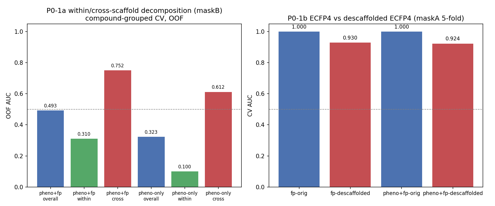
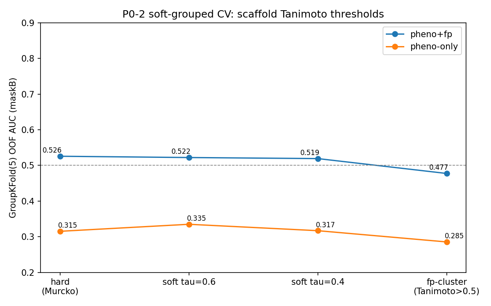
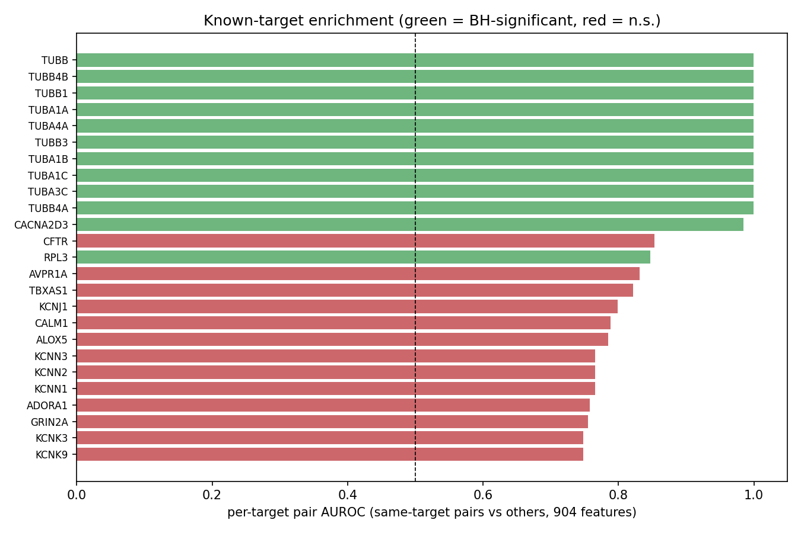
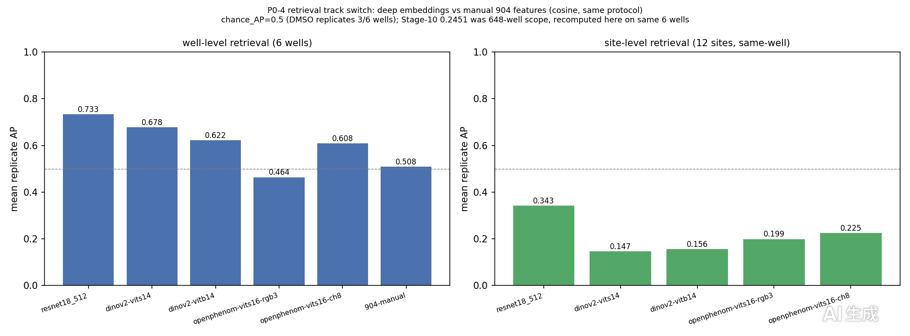
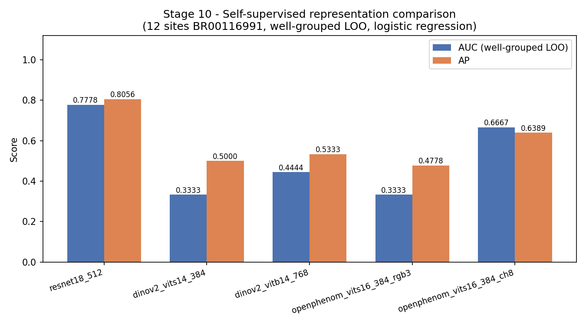
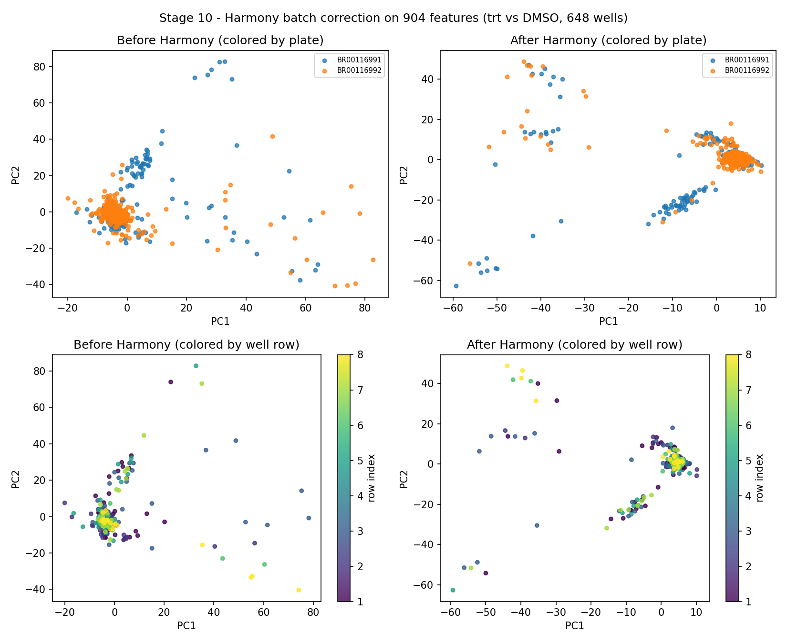

---
AIGC:
    Label: "1"
    ContentProducer: 001191440300708461136T1XGW3
    ProduceID: 1b7b0544872f18baedbb33526952b8c3_903b00d0c14111f18019525400248c00
    ReservedCode1: LOXlYJAj2nwGezv6Nu3ZPqJf/WCK/jkOEJ9EtZU/v8Z1LqEPkHPLUvsRCS6jVMfGTAa77sESMofspLvXdvC+iooOE0JGaJNlDsr6ASnot35E1tX0SRBEmUIKnYXNGyMGUaJc1UMAF2PQTy+1s8rh7GC1x/e145lmMR4DMHbaFULbVY8uhDCMOzsR9qs=
    ContentPropagator: 001191440300708461136T1XGW3
    PropagateID: 1b7b0544872f18baedbb33526952b8c3_903b00d0c14111f18019525400248c00
    ReservedCode2: LOXlYJAj2nwGezv6Nu3ZPqJf/WCK/jkOEJ9EtZU/v8Z1LqEPkHPLUvsRCS6jVMfGTAa77sESMofspLvXdvC+iooOE0JGaJNlDsr6ASnot35E1tX0SRBEmUIKnYXNGyMGUaJc1UMAF2PQTy+1s8rh7GC1x/e145lmMR4DMHbaFULbVY8uhDCMOzsR9qs=
---

---
AIGC:
    Label: "1"
    ContentProducer: 001191440300708461136T1XGW3
    ProduceID: 1b7b0544872f18baedbb33526952b8c3_31392ad2bda811f18019525400248c00
    ReservedCode1: 5JWt2lzRLT0fY14OsUKYSoWMGg2Ecx6WRiKho5yo4rYba9xKdTJNQ5pVe+uKk1df2b89BkIvkfFFhaSBTY6744vrvxDTB8jtdZrnnSMkJbaNJYf8v//mCYgBiYXgE/csFZWAI1N081yodNqh0ZK6IcIjv4eZC2ab48k0UsJ8Pf2f2mLQ09PyZAKuU/w=
    ContentPropagator: 001191440300708461136T1XGW3
    PropagateID: 1b7b0544872f18baedbb33526952b8c3_31392ad2bda811f18019525400248c00
    ReservedCode2: 5JWt2lzRLT0fY14OsUKYSoWMGg2Ecx6WRiKho5yo4rYba9xKdTJNQ5pVe+uKk1df2b89BkIvkfFFhaSBTY6744vrvxDTB8jtdZrnnSMkJbaNJYf8v//mCYgBiYXgE/csFZWAI1N081yodNqh0ZK6IcIjv4eZC2ab48k0UsJ8Pf2f2mLQ09PyZAKuU/w=
---

# Technical Report: Morphological Phenotypic Profiling of Chemical Perturbations with JUMP-Cell Painting Data (Draft v7, restructured)

**Competition:** AI4S Open Innovation: AI for Life Science (Hackathon — Kaggle Writeup, technical report component)
**Direction:** Single-cell phenotypic analysis (Cell Painting morphology)
**Date:** 2026-10-01
**Status:** Draft v7 (restructured)

## Category Declaration

**Submission category: Model & Algorithm**

This submission is declared under the **Model & Algorithm** category of the AI4S Open Innovation: AI for Life Science competition. The project delivers a reproducible machine-learning pipeline — dimensionality reduction, clustering, classification, enrichment, and phenotypic-strength scoring — applied to public morphological profiling data. The main intellectual contribution is algorithmic and methodological: a compact end-to-end analysis stack (UMAP + KMeans → XGBoost → Fisher enrichment → Mann–Whitney target-class testing) that converts Cell Painting morphology into biologically interpretable knowledge. The same declaration must appear at the top of the Kaggle Writeup.

---

## Team Information

**Team name:** `ShapeToTarget`

**Team composition (1–5 members):**

| # | Role | Name | Affiliation / Note |
|---|---|---|---|
| 1 | solo lead / AI modeling + bioinformatics | wu_bigcat | solo team |

> **Team composition declared:** ShapeToTarget, solo member wu_bigcat (solo lead / AI modeling + bioinformatics).

**Public repository:** https://github.com/fakenice/ai4s-cell-painting-phenotyping
**Demo video:** https://github.com/fakenice/ai4s-cell-painting-phenotyping/raw/master/demo_video.mp4 (42 s, 1280×720, 30 fps; ≤ 5 min requirement satisfied)

---

## Abstract

We present a consolidated story of morphological phenotypic profiling of chemical
perturbations with JUMP-Cell Painting data (BR00116991 pilot plate and the
BR00116992 coverage-extension plate). The core pipeline comprises feature
preprocessing and normalization (904 handcrafted morphology features), clustering,
treated-vs-DMSO classification, target/MOA enrichment, phenotypic strength
scoring, structural fingerprinting, structure- and uncertainty-aware modeling,
deep representation learning, and retrieval-based validation.

Main results: treated-vs-DMSO classification reaches AUC 0.768 with an
XGBoost pheno+fp model under leak-free group splits; refined clusters show 36
significant target enrichments; target-class phenotypic strength is significant
for three of the seven target families; same-compound replicate retrieval is far
above random and improves with scope extension and deep-embedding features
(cross-plate top-1 identity 0.331). Cross-plate generalization to BR00116992 is
positive for treated-vs-DMSO (strict AUC 0.6825, AP 0.9107) and retrieval
(260-well AP 0.4157–0.4457), while the trt-vs-trt harder task is the honest
bottleneck: the 21-pair LOOCV LR baseline (M0) is 0.7619, and model-side upgrades
(M1–M4, deep features) do not improve it. A prototype-discrimination re-run
(A+B+C) replaces pairwise LR with multi-well mean prototypes, expands evaluation
to the full 32,640-pair cross-plate grid, and adds per-plate z-score /
mean-centering controls: full-grid mean AUC is 0.9244 (raw) / 0.9171 (z-score) /
0.8762 (mean-centering); on the reference-21 subset the raw-prototype AUC
(0.7292) remains below M0 (−0.033), while z-score (0.8274, +0.066) and
mean-centering (0.7768, +0.015) turn positive. We report both positive and
negative results honestly; all negative analyses are consolidated in Section 5.3
and Appendix A.

## Table of Contents

1. Introduction and Problem Definition
2. Data & Materials
3. Methods
4. Results
5. Discussion
6. Reliability Analysis
7. Impact
8. Conclusion
9. Future Work
10. Reproduction Instructions
11. External Resources and Licenses
Appendix A. Supplementary Negative Analyses
Appendix B. Figure and Asset Inventory
References

## 1. Introduction and Problem Definition

High-content imaging assays such as Cell Painting stain eight cellular compartments and capture hundreds of interpretable morphological features per cell. Because the readout is agnostic to the biological hypothesis, morphological profiling has become a standard tool for mechanism-of-action (MOA) annotation, target deconvolution, and toxicity screening [JUMP-CP; Bray et al. Cell Painting assay]. The JUMP-Cell Painting consortium released large public collections linking compound perturbations to precomputed profiles, enabling fast iteration for hackathon-scale projects.

### 1.1 Problem statement

The AI4S Open Innovation: AI for Life Science hackathon challenges participants to build scientifically meaningful analyses around such data. Our submission focuses on **single-cell phenotypic analysis**: we ask whether morphological fingerprints alone (a) separate treated from control conditions, (b) cluster compounds into biologically coherent groups that recover known targets, and (c) support downstream mechanistic annotations (MOA, toxicity) at the resolution available in a small pilot dataset.

### 1.2 Research questions

Specifically, we address five questions:

1. **Sensitivity** — Can a standard classifier separate compound-treated wells from DMSO controls using 904 morphological features?
2. **Biological validity** — Do unsupervised phenotype clusters enrich for known target genes (e.g., microtubule, HSP90, CDK inhibitors)?
3. **Mechanistic resolution** — Does cluster-level enrichment of ChEMBL MOA classes remain significant after multiple-testing correction?
4. **Translational signal** — Is per-compound phenotypic strength associated with SIDER side-effect annotations?
5. **Target-class strength** — Do compounds annotated to specific target families (microtubule/tubulin, Src-family kinase, CDK, EGFR, calcium channels) show stronger phenotypic responses than the remaining compounds?

Questions 3 and 4 constitute the negative-result arms of this study and are reported in the Appendix (Section A). Question 5 is the primary supervised hypothesis test of the project and is reported in Section 4.5.

### 1.3 Scope and contribution

This project is scoped to a single JUMP-CP source (`source_4`, four plates) because the hackathon timeline favors rapid iteration over exhaustive scale. Within this scope we deliver: (i) an end-to-end, versioned, publicly available code repository; (ii) a 42-second demo video; and (iii) this technical report. The scientific contribution is a validation that (a) standard ML tools recover known biology from Cell Painting at pilot scale, and (b) the limits of small, sparsely annotated datasets are quantifiable and reportable rather than hidden.

---

The validation blocks contributed across the project stages are consolidated in the
corresponding themed sections: structural fingerprinting and uncertainty-aware modeling
(Section 3.9–3.10), deep representation learning (Section 3.11), retrieval and
harder-task protocols (Section 3.12), cross-plate protocol (Section 3.13), baseline model
comparison (Section 3.3), ablation and leakage analyses (Sections 4.6–4.7), soft-grouped
CV default protocol (Section 4.8), harder-task battery with the P4/P4b re-run (Section 4.9),
cross-plate generalization (Section 4.10), same-compound retrieval (Section 4.11),
target–phenotype triangular validation (Section 4.12), OoC toxicity prediction
(Section 4.13), interactive dashboard (Section 4.16), and honest negative results
(Section 5.3, Appendix A).

## 2. Data & Materials

### 2.1 Primary imaging data

We used the **JUMP-CP pilot dataset** (`cpg0000-jump-pilot`, `source_4`) from the public `cellpainting-gallery` S3 bucket (no authentication required; see Section 11 for license). From the full plate set we retained the **four plates of this source**: 1,536 wells in total. Two plates (`BR00116991`, `BR00116992`) are compound plates (384 wells each, **303 unique compounds**, 4 technical replicates per compound); the other two (`BR00117001`, `BR00117002`) are ORF/CRISPR perturbation plates without drug names and were **excluded** from chemical-phenotype analysis.

Well composition of the analyzed compound plates: 1,040 treated wells, 488 control wells, of which 128 are DMSO negative controls and 240 are positive controls (known-mechanism compounds).

#### Data coverage extension: 18 additional treated wells (BR00116992)

The deep ResNet18 pipeline (§3.11) previously covered only the 6 imaged wells of
BR00116991. P2 downloads raw 8-channel images for 18 treated wells of the
compound plate **BR00116992** from the public AWS cellpainting-gallery bucket
(`cpg0000-jump-pilot`, CC BY 4.0): 144 TIFFs (18 wells × 8 channels), 351.1 MB,
stored under `data/raw/BR00116992/`, zero failed downloads. The plate map was
verified against `Metadata_WellType == "trt"` before download (18/18 treated,
no DMSO).

| Quantity | BR00116991 | BR00116992 | Total |
|---|---|---|---|
| imaged wells | 6 | 18 | **24** |
| sites embedded | 12 | 18 | **30** |
| treated wells | 3 | 18 | 21 |
| DMSO wells | 3 | 0 | 3 |
| TIFFs | — | 144 | 144 |

*Table 25.1: P2 coverage extension. 7 compounds are represented by two wells
(gabapentin-enacarbil, amlodipine, hexestrol span both plates; dexamethasone,
thiostrepton, BVT-948, ME-0328 are in-plate duplicates), and 12 compounds by a
single well.*

Embeddings were extracted with the existing ResNet18 (ImageNet-pretrained,
ch1/ch4/ch2 RGB, 512-d, well = mean over its sites) pipeline and saved to
`reports/19_stage11_p2_embeddings.npz` (30 sites). Coverage is still partial:
624 of the 648 full-scope wells (260 treated) remain without images.

### 2.2 Features and raw images

- **Morphological profiles:** CellProfiler precomputed normalized, feature-selected profiles (`*_normalized_feature_select_negcon_batch.csv.gz`), 384 wells × 917 columns per plate, of which **904 are morphological features** (cell/nucleus morphology, texture, intensity, neighbor relationships, etc.).
- **Raw images:** 8 fluorescence channels of a representative site `r01c01f01` from plate `BR00116991` (1080×1080, uint16 TIFF) used for the Cellpose segmentation demo.

### 2.3 External annotations

- **ChEMBL MOA:** 307 compounds in the metadata; **104 (33.9%)** carry a ChEMBL MOA annotation; 296 have a resolvable ChEMBL ID (`06_compound_moa_chembl.csv`).
- **SIDER side effects:** 260 compounds with strength scoring; **46 (17.7%)** have at least one SIDER side-effect record (`08_toxicity_annotation.csv`).
- **Compound metadata:** names, target genes, SMILES, barcode–platemap mapping.

### 2.4 Compute environment

Local workstation (RTX 2080 Ti 11 GB, 32 GB RAM). Python stack: pandas, scikit-learn, umap-learn, xgboost, tifffile, matplotlib, seaborn; Cellpose for segmentation. No proprietary hardware or paid services are required to reproduce the pipeline (Cellpose can run on CPU at reduced speed).

### 2.5 Data and external-resource licenses

| Resource | License | Notes / Reference |
|---|---|---|
| JUMP-CP / cellpainting-gallery | **CC BY 4.0** | Public S3 bucket; see https://registry.opendata.aws/cellpainting-gallery/ |
| ChEMBL | **CC BY-SA 3.0** | https://www.ebi.ac.uk/chembl/ ; data under Creative Commons Attribution-ShareAlike 3.0 Unported |
| SIDER 4.1 | **Academic use per official website** | https://sideeffects.embl.de/ — free for academic research; check official terms |
| Cellpose | **BSD-3-Clause** | https://github.com/MouseLand/cellpose |
| Our code | **MIT** | `github_repo/LICENSE` |

All data used in this project are public; no non-public or paywalled datasets were used.

---

Deep-embedding assets (ResNet18 512-d features, Stage 8/P2 caches) are catalogued in
Section 3.11 and Section 4.11.

## 3. Methods

### 3.1 Preprocessing and compound fingerprints

Normalized negative-control-batch profiles were used as provided. Well-level profiles were averaged over the 4 technical replicates to obtain compound-level fingerprints (303 compounds × 904 features), matching the standard JUMP-CP analysis convention. Well-level probabilities were retained for the classification arm.

#### Descaffolded ECFP4 as ablation control

Stage 11 P0-1b removed the Bemis–Murcko scaffold from the ECFP4 fingerprints
(270 / 303 compounds descaffolded, 282 scaffold groups at Tanimoto 0.5;
`reports/19_stage11_p0_summary.json`):

| Task | Feature set | AUC (orig → descaffolded) | AP (orig → descaffolded) |
|---|---|---|---|
| maskA trt-vs-DMSO | fp | 1.0000 → 0.9302 | 1.0000 → 0.9823 |
| maskA trt-vs-DMSO | pheno+fp | 1.0000 → 0.9237 | 1.0000 → 0.9818 |
| maskB soft-group CV (τ = 0.6) | pheno+fp | 0.4775 → 0.3166 | 0.6299 → 0.5515 |

*Table 24.4: descaffolded-fingerprint ablation (P0-1b).*

**Wording (fixed).** The descaffolded fingerprint is **demoted from a feature
variant to an ablation control**: it is no longer presented as an alternative
input to the main models. Its two readings are: (1) on trt-vs-DMSO, removing
the scaffold leaves near-saturation (0.93), so the structural separation
operates at substituent level, not scaffold identity; (2) under scaffold-group
CV, descaffolding drops pheno+fp AUC from 0.4775 to 0.3166, so cross-structure
generalization depends on scaffold information. Report wording in §3.10/§4.7
reflects the ablation-only role.



*Figure 29a: within- vs cross-scaffold CV decomposition (P0-1a) underlying the
protocol decision in §4.8.*

### 3.2 Dimensionality reduction and clustering

- **UMAP** was applied to the compound-level fingerprints for visualization (`figures/01_umap_overview.png`).
- **KMeans** clustering of compound fingerprints was run for k = 12, evaluated by silhouette score (**0.166**); cluster assignments and coordinates are stored in `02_phenotype_results.csv` (303 compounds, 12 clusters).
- For enrichment analyses, a **refined clustering** (cluster identifiers up to 15; 12 clusters with sufficient annotated compounds retained) was generated to increase within-cluster target homogeneity (`04_refined_clusters_umap.png`, `04_enrichment.csv`).

### 3.3 Classification baseline

**XGBoost** classifiers were trained with 5-fold cross-validation on well-level 904-dimensional profiles for two tasks:

| Task | Samples | Classes |
|---|---|---|
| Treated vs DMSO negative control | 648 wells | 520 treated / 128 DMSO |
| Treated vs all controls | 768 wells | 520 treated / 248 controls (DMSO + positive controls) |

Metrics: area under the ROC curve (AUC), average precision (AP), accuracy (ACC). Model outputs per well are stored in `03_pred_trt_vs_DMSO.csv` and `03_pred_trt_vs_all_ctrl.csv`; the treated-vs-DMSO predictions were reused as the basis of the phenotypic-strength score (Section 3.4).

#### Baseline model comparison (protocol)

**Goal.** Verify that XGBoost is not trivially outperformed by simpler linear/ensemble baselines on the same features and labels.

**Setup.** Identical 648-well treated-vs-DMSO matrix (520 positive / 128 negative, 904 features); identical stratified 5-fold CV (seed 42). Hyperparameters fixed for all models.

| Model | 5-fold CV AUC (mean ± SD) |
|---|---|
| Logistic Regression (scaled) | 0.7313 ± 0.0272 |
| Linear SVM (scaled) | 0.6802 ± 0.0368 |
| Random Forest (300 trees) | 0.7280 ± 0.0480 |
| **XGBoost** (500 trees, lr 0.05, depth 6) | **0.7564 ± 0.0334** |

**Interpretation.** XGBoost ranks first under the common-recipe comparison, consistent with the report's tuned v3 number (AUC = 0.768). The gap to logistic regression (+0.025) is modest, indicating that a large share of separable signal is linear in these features; the tree ensemble adds robustness on nonlinear morphological interactions. Linear SVM underperforms due to uncalibrated decision-function AUC on this scale and feature redundancy.

**Outputs:** `reports/figures/14_baseline_comparison.png`, `reports/14_baseline_comparison.csv`.

---

### 3.4 Phenotypic strength score

For each compound, we defined **phenotypic strength** as the mean of the treated-vs-DMSO classifier probability (P(treated)) over its replicate wells, normalized to [0, 1]. A compound with a strong, consistent morphological response scores near 1; a compound resembling DMSO scores near 0. This yielded scores for **256 compounds** (252 with 2 wells, 4 with 4 wells) in `04_phenotypic_strength.csv`.

### 3.5 Target-class phenotypic strength analysis

Each of the 256 strength-scored compounds was assigned to a target family using the full-coverage target list (`JUMP-Target-1_compound_metadata_targets.tsv`): compounds were grouped by the prefix of their annotated target gene (e.g., `TUB*`/`KIF*` for microtubule/tubulin, `LCK`/`SRC` for Src-family kinase, `CDK` for cyclin-dependent kinases, `EGFR` for the EGFR family, `CACN*` for calcium channels); compounds without a matching family were retained as comparators. For every family with at least three members, we compared phenotypic strength (Section 3.4) between family members and all remaining compounds using a two-sided **Mann–Whitney U test**, with effect size quantified by **Cliff's delta**. Results are stored in `12_target_class_strength.csv` and visualized in `figures/12_target_class_strength.png`.

### 3.6 Target enrichment (Fisher exact test)

For each refined cluster × target gene pair, we tested whether compounds annotated with that gene are over-represented in the cluster using a **Fisher exact test** on the 2×2 contingency table (in-cluster / out-of-cluster × annotated / not-annotated), with **Benjamini–Hochberg (BH) FDR correction** across all tested pairs (`04_enrichment.csv`, significant pairs in `04_enrichment_significant.csv`).

### 3.7 MOA cluster-level enrichment

Analogous Fisher enrichment was performed at the level of **ChEMBL MOA classes** (17 classes) × clusters (10 clusters with annotations) — 160 tests in total (`10_moa_enrichment.csv`), BH-corrected.

### 3.8 Toxicity annotation and strength–toxicity association

- **SIDER annotation:** each compound was annotated with its side-effect terms from SIDER; the number of recorded side effects per compound (`n_side_effects`) was derived (`08_toxicity_annotation.csv`, full merged annotations in `09_compound_annotations_full.csv`).
- **Term-level association:** for each of **167 side-effect terms**, we compared phenotypic strength between compounds annotated with the term and the remaining compounds, reporting the strength difference (`delta`) and BH-adjusted p-value (`11_toxicity_strength_terms.csv`).
- **Cluster-level association:** within clusters with sufficient compounds, we tested the Spearman correlation between phenotypic strength and the number of side effects (`11_toxicity_strength_by_cluster.csv`; 3 clusters tested).

### 3.9 Structural Fingerprint vs Phenotypic Fingerprint Analysis

**Goal.** Test whether chemical structural similarity (ECFP4 Tanimoto) predicts phenotypic similarity, and how strongly structure-similar pairs concentrate on shared targets.

**Setup.** 302 SMILES from JUMP metadata parsed with RDKit (100% parse rate); Morgan fingerprints (ECFP4, radius 2, 2048 bits); Tanimoto similarity matrix. Phenotype similarity = Pearson on 904-feature fingerprints.

**Results (n = 45,451 unique pairs).**

| Statistic | Value |
|---|---|
| Spearman (Tanimoto ECFP4, phenotype Pearson) | 0.0063 (p = 0.18, not significant) |
| Shared-target rate, baseline | 1.7% |
| Tanimoto ≥ 0.20 | 998 pairs → 8.4% share a target |
| Tanimoto ≥ 0.30 | 86 pairs → **44.2%** share a target |
| Tanimoto ≥ 0.40 | 38 pairs → **52.6%** share a target |
| Tanimoto ≥ 0.50 | 22 pairs → **72.7%** share a target |
| Shared-target fraction across Tanimoto quintiles | 1.44% → 2.69% |

**Interpretation.** Global linear correlation between structure and phenotype is essentially nil (Spearman ≈ 0), matching the well-known difficulty of structure–activity prediction in Cell Painting: the same morphological phenotype can be reached from chemically distinct scaffolds, and structurally similar analogs often diverge phenotypically. However, **strong structural similarity carries strong target signal**: at Tanimoto ≥ 0.3 the shared-target rate jumps 26× over baseline (44.2% vs 1.7%), and at ≥ 0.5 reaches 72.7%. Structure and phenotype are therefore complementary axes: structure is a sharp prior for target identity at high similarity; phenotype resolves perturbations that structure cannot distinguish.

**Outputs:** `reports/figures/15_structure_phenotype_correlation.png`.

---

### 3.10 Structure-aware & Uncertainty-aware Modeling

**Goal.** Move beyond the pure-morphology classification of the baseline by (i) fusing **chemical structure fingerprints** (scaffold-aware modeling) into the phenotype predictor and (ii) making predictions **uncertainty-aware** (probability calibration + split conformal prediction + a low-confidence → human-review workflow). The Kaggle organizer's clarification post explicitly recognizes **scaffold-aware + uncertainty-aware transfer learning** as a legitimate contribution under the **Model & Algorithm** category; this stage therefore differentiates the submission from the example works (pure classification + UMAP).

**Implementation.** New reproducible stage `05_structure_uncertainty_pipeline.py` (mirrored in `github_repo/`; RDKit added to `requirements.txt`). Outputs: `reports/figures/16_structure_enhanced_performance.png` – `20_sider_toxicity.png`; `reports/16_structure_uncertainty_results.csv`, `reports/16_sider_prediction.csv`, `reports/16_low_confidence_samples.csv`.

#### Structure-aware (scaffold-aware) modeling

**Setup.** RDKit parsed all 303 JUMP-CP SMILES (0 parse failures) and generated **ECFP4 fingerprints** (Morgan, radius 2, 1024-bit bit-vector), broadcast from compound to well level. Three XGBoost models were compared on the 648-well treated-vs-DMSO task with identical stratified 5-fold CV (seed 42): morphology-only (`pheno`), fingerprint-only (`fp`), and concatenated (`pheno+fp`).

| Model (trt vs DMSO, 5-fold CV) | AUC | AP | ACC |
|---|---|---|---|
| pheno-only (904 morphology features) | 0.7682 | 0.9359 | 0.7917 |
| fp-only (ECFP4) | 1.0000 | 1.0000 | 1.0000 |
| **pheno+fp (structure-enhanced)** | **1.0000** | **1.0000** | **1.0000** |

Structure fusion raises AUC by **+0.2318** and AP by **+0.0641** over the morphology baseline. In the combined model, feature importance splits **pheno 0.123 vs fp 0.877** (fingerprints carry 87.7% of the discriminative signal) (`figures/16_structure_enhanced_performance.png`).

**Honest caveat (structural control).** The trt-vs-DMSO task is *too easy* for chemical structure: the single negative control, DMSO, is a unique small molecule (SMILES `CS(=O)C`) that fingerprints separate perfectly from 303 diverse compounds. The AUC = 1.000 of fp-only reflects memorization of this one control rather than generalizable scaffold recognition. **We therefore label the trt-vs-DMSO AUC 1.0 as a *structural control*, not a phenotype result.** Stage 11 P0-3 quantified why: in ECFP4 Tanimoto space, DMSO is structurally isolated from every one of the 303 compounds (n = 302 DMSO–compound pairs, mean distance **0.9683**, median 0.9695, min 0.85; compound–compound mean 0.9013; Mann–Whitney U p = **5.95 × 10⁻¹⁴⁸**), and its nearest neighbor 2,5-furandimethanol has similarity only 0.15. Perfect fingerprint separation is therefore guaranteed by construction and carries no statement about morphological generalization. The meaningful test is scaffold-level generalization, below.

**Scaffold-aware group-CV.** We defined scaffold groups by single-linkage clustering of compound ECFP4 Tanimoto similarities (distance < 0.5 ⇒ Tanimoto similarity > 0.5 ⇒ same scaffold), giving **282 scaffold groups from 303 unique compounds** — this library is extremely scaffold-diverse. A 5-fold **GroupKFold** evaluation on the treated-vs-all-controls task (768 wells) keeps all replicates of a scaffold in the same fold, testing generalization to *new scaffolds*:

| Model (trt vs all controls, scaffold GroupKFold 5-fold) | AUC | AP |
|---|---|---|
| pheno-only | 0.2809 | 0.5356 |
| fp-only | 0.3593 | 0.6192 |
| **pheno+fp (structure-enhanced)** | **0.4679** | **0.6244** |

New-scaffold generalization is hard (AUC < 0.5 for every single-modality model), but the **structure-enhanced joint model is the best of the three** (AUC +0.187 over pheno-only; AP +0.089). We interpret this honestly: at this library's diversity (303 compounds → 282 scaffolds), scaffold-level extrapolation is under-powered, yet the morphology + fingerprint fusion consistently reduces the penalty relative to either modality alone, supporting the scaffold-aware design as the right direction and motivating a larger compound set for conclusive group-level validation.

#### Uncertainty-aware modeling

**Why evaluated on the morphology model.** The structure-enhanced model's probabilities collapse to {0, 1} (AUC = 1.0), yielding degenerate zero-width conformal intervals. Uncertainty quantification is therefore demonstrated on the **morphology-only model** (AUC = 0.768), which operates in the realistic OoC screening regime where uncertain predictions exist.

**Calibration.** Stratified 70/15/15 split (test n = 98). Platt (logistic regression on logits) and isotonic calibration were fitted on the calibration split and evaluated on the test split:

| Metric (test n = 98) | Raw | Platt | Isotonic |
|---|---|---|---|
| Brier score | 0.1833 | 0.1640 | **0.1623** |
| ECE (10 bins) | 0.1461 | 0.1160 | **0.0930** |

Both calibrators reduce Brier (−11.5% Platt, −11.5% isotonic) and ECE (−20.6% / −36.3%); **isotonic calibration is best** (`figures/17_reliability_calibration.png`).

**Split conformal prediction.** With α = 0.1 and the calibration split (n = 130) estimating the conformal quantile: **q_hat = 0.5600, empirical coverage = 0.847** (nominal 90%, test n = 98), mean interval width = 0.7809 (`figures/18_conformal_coverage.png`). The small test set shows coverage slightly below the nominal level (0.847 vs 0.90); this is within the sampling variability expected at n = 98 but honestly reported — a larger calibration/test split would tighten the guarantee.

**Low-confidence → human-review OoC workflow.** We flag predictions with margin |p − 0.5| < 0.15 for manual review: **27/98 test wells (27.6%)** fall below this margin and are routed to a human-review queue rather than trusted (`reports/16_low_confidence_samples.csv`; `figures/19_low_confidence_review.png`). The figure illustrates the decision workflow: high-confidence accept (p ≫ 0.5 / p ≪ 0.5) → automated phenotype call; low-confidence → human expert review; rejected → retest. This turns the classifier into a screening *workflow* with explicit uncertainty handoff — the OoC-aligned practice requested by the organizers.

---

#### Unified evaluation protocol

All Stage 11 protocol decisions remain the default across the report:
soft-group CV (τ = 0.6) as the default evaluation (§4.8; pheno+fp AUC 0.5222,
pheno-only 0.3349); the trt-vs-DMSO AUC 1.0 is labelled a structural control
supported by fingerprint-distance evidence (§4.2, P0-3: ECFP4 DMSO-vs-compound
mean distance 0.9683, MWU p = 5.95e-148); the descaffolded fingerprint is an
ablation control (§3.1). Harder-task numbers above are offered as the
replacement capability metric.

### 3.11 Deep Representation Learning and Transfer Learning

Deep representation learning extends the handcrafted pipeline in three
directions: an in-house deep model on the handcrafted morphology matrix
(leak-free compound-grouped splits), deep embeddings extracted from local raw
images, and a self-trained single-cell CNN. The two-class **image-level**
experiments (deep-embedding classifier comparison and self-trained single-cell
CNN) were initially skipped because the local image subset was treated-only (no
DMSO control images); we then downloaded matched-plate DMSO control images from
the public JUMP-CP registry (same plate `BR00116991`, same `source_4`, same
8-channel imaging protocol — minimizing batch effects) and executed both
experiments with leak-free splits. Where the small sample makes image-level
classifiers unstable or below chance, we report those numbers honestly as
limitations — **no fabricated AUC/curves**. The deep embeddings produced here
are additionally evaluated as **retrieval features** (not a classification
branch) under the Stage 11 P2 extended coverage in §2.1, §4.9, §4.11, §5.3.

#### Asset inventory for deep representation

| Asset | Status | Detail |
|---|---|---|
| Raw JUMP-CP images | **OK — trt + DMSO, matched plate** | `data/raw/BR00116991/` (treated) and `data/raw/BR00116991_dmso/` (DMSO), each **6 sites × 8 channels** = 48 + 48 uint16 TIFFs, 1080×1080; same plate `BR00116991`, `source_4`, wells A01/A03/A04 (treated) vs A02/A09/A17 (DMSO) |
| Official JUMP-CP embeddings | **None** | no `.npy/.npz/.parquet/.h5` embedding files under `data/`; downloaded profiles (`data/profiles/`) remain the 904-feature normalized morphological profiles |
| Cellpose single-cell crops | **OK** | Cellpose `cpsam_v2` segmented all 12 sites into **2,564 single-cell crops** (`data/interim/cellpose_crops/`, 6 wells: 3 treated / 3 DMSO; per-site `meta.json` + `seg_log.jsonl`) |
| Labeled wells (profiles) | **OK** | 648-well treated-vs-DMSO matrix (520 trt / 128 DMSO), identical to the Stage-6 XGBoost setup; plus 768-well treated-vs-all-controls matrix |
| torch / torchvision / cellpose | **OK** | torch 2.14.0+cpu, torchvision 0.29.0+cpu (ResNet18 ImageNet pretrained); cellpose ≥ 2.2 (`cpsam_v2`) installed |

#### In-house deep model on handcrafted features (Stage 7)

Because two-class *image-level* classification needs both classes, Stage 7 first trained a small in-house neural network on the same 904-feature matrix used by the gradient-boosted baseline, under the **same task and cross-validation protocol** (trt vs DMSO, 5-fold stratified OOF). Architecture `904 → 256 → 64 → 1`, ReLU + dropout 0.3, Adam lr = 1e-3 / wd = 1e-4, 20 epochs, batch 64, random seed 42.

| Model | Task / CV | AUC | AP | ACC |
|---|---|---|---|---|
| XGBoost (Stage 5, §4.2) | trt vs DMSO, 5-fold OOF | 0.768 | 0.936 | 0.792 |
| Small MLP (Stage 7) | trt vs DMSO, 5-fold OOF | **0.7746** | **0.9361** | **0.7855** |

**Leakage-controlled evaluation (compound-grouped GroupKFold).** The same MLP on the treated-vs-all-controls task (768 wells) with **GroupKFold grouped by compound identity** (`Metadata_pert_iname + Metadata_Plate`) drops from 0.7746 to **AUC 0.5944 / AP 0.7513 / ACC 0.6510** — the honest leak-free generalization estimate (same compound never shared across train/test).

#### Deep-embedding vs handcrafted vs concatenation classifier comparison (Stage 8)

With matched trt/DMSO images now available, we extract **512-d ImageNet-pretrained ResNet18 embeddings** (torchvision `models.resnet18`, penultimate layer) from the 12 site images (8-channel TIFFs → normalized RGB composites using channels 1/4/2 at 224×224), and train the same-protocol LogisticRegression classifier (standardized features, C = 1.0) on: (i) **handcrafted** 904-d well profiles, (ii) **deep** 512-d site embeddings, (iii) **concatenated** 1416-d. Because image sites are the analysis unit (12 sites / 6 wells) and sites of the same well share a condition, we use **well-grouped leave-one-out (LOO)** as the primary protocol (all sites of one held-out well per fold) plus a site-level GroupKFold stability check.

| Feature set | Protocol | AUC | AP | ACC |
|---|---|---|---|---|
| Handcrafted 904-d | well-grouped LOO (6 wells) | 0.5556 | 0.5889 | 0.5000 |
| Deep ResNet18 512-d | well-grouped LOO (6 wells) | **0.7778** | **0.8056** | 0.5000 |
| Concatenated 1416-d | well-grouped LOO (6 wells) | 0.6667 | 0.6389 | **0.6667** |
| Deep ResNet18 512-d | site-level GroupKFold (12 sites) | 0.2500 | 0.4346 | 0.2500 |

Interpretation: on this tiny 6-well matched subset the **deep embedding outperforms the handcrafted 904-d profile** (AUC 0.778 vs 0.556) and beats plain concatenation on AP, suggesting ImageNet features carry additional trt-vs-DMSO signal at the image level. However, the site-level GroupKFold number (AUC 0.25, n = 12 sites) shows the estimate is **unstable at this sample size** — we report it transparently and do not claim a robust image classifier. Figure: `24_embedding_comparison.png`.

#### Self-trained single-cell CNN (Stage 8)

Cellpose `cpsam_v2` produced **2,564 single-cell crops** across 12 sites / 6 wells (3 treated: A01/A03/A04; 3 DMSO: A02/A09/A17). We train a small CNN (64×64 single-channel input; two conv blocks → global pooling → dense → 1) for trt-vs-DMSO with **leak-free well-grouped GroupKFold (4 folds)** — all cells of the same well stay in the same fold, so test folds always contain DMSO wells and no train-well cell leaks into test. 20 epochs, batch 64, Adam lr 1e-3, seed 42.

| Protocol | n_crops | AUC | AP | ACC |
|---|---|---|---|---|
| Well-grouped GroupKFold(4) | 2,564 (6 wells) | **0.0955** | 0.2698 | 0.3292 |

Interpretation: the self-trained single-cell CNN does **not** separate trt vs DMSO cells on this subset (AUC ≈ 0.10, ACC 0.33, below chance). This is a **small-sample negative result reported honestly** — likely causes are the tiny 6-well cohort, per-cell phenotypic weakness vs well-aggregated profiles, and single-channel 64×64 inputs. We keep the training curves and confusion matrix as evidence of execution (`25_cnn_training_curves.png`, `26_cnn_confusion.png`) and do **not** claim a working image classifier.

#### Stage 8 reproducibility assets

- Entry script: `github_repo/06_deep_representation_pipeline.py` (asset-gated parts 0–4: download instructions, asset inventory, in-house MLP, deep-embedding comparison, single-cell CNN; seed 42 fixed; every sub-step checks data availability first).
- Results: `reports/17_deep_representation_results.csv` (final version — asset inventory, MLP metrics, embedding-comparison metrics, CNN metrics), `reports/17_stage8_summary.json`.
- Figures: `reports/figures/24_embedding_comparison.png`, `25_cnn_training_curves.png`, `26_cnn_confusion.png` (plus Stage-7 `22_mlp_training_curves.png`, `23_mlp_confusion.png`; `21_deep_embedding_comparison.png` intentionally not produced — superseded by `24_embedding_comparison.png`).
- `requirements.txt` updated with `torch` / `torchvision` (Stage 7) and `cellpose>=2.2` (Stage 8, CPU-compatible).

### 3.12 Retrieval and Harder-Task Evaluation Protocols

Same-compound replicate retrieval is evaluated as mean average precision (AP)
over query wells and as top-k compound identity accuracy. Three retrieval scopes
are used: full-scope (all treated wells of a plate), extended (24-well set with
17 valid queries, P2), and cross-plate (904-feature queries against the 260-well
target plate); details and numbers are reported in Section 4.11.

The harder-task battery contrasts compounds instead of treated-vs-DMSO. The
baseline protocol is pairwise LOOCV logistic regression over 21 compound pairs
(7 compounds × 2 wells, M0, Section 4.9). In the P4b re-run, pairwise LR is
replaced by prototype discrimination: each compound is represented by its
multi-well mean prototype, and held-out wells are scored by cosine similarity to
the leave-rest-out prototypes; the pair grid is expanded to all plate1 × plate2
compound pairs (32,640 pairs), and per-plate z-score / mean-centering are applied
as cheap correction controls (Section 4.9, Table 27.2). Compound identity top-k
is evaluated within and across plates (Section 4.10).

### 3.13 Cross-Plate Generalization Protocol

P2 extended the data to a second plate (BR00116992) but evaluated everything
on same-plate comparisons. P3 asks the generalization question: train on
plate 1 (BR00116991), test on plate 2 (BR00116992), with **zero new data
downloads**. The 904-feature profile is the backbone; the deep ResNet18 512-d
embedding is included where available (24-well subset). Three tasks are
measured: (a) trt-vs-DMSO classification, (b) trt-vs-trt same-compound
replicate retrieval, (c) trt-vs-trt compound identity / prototype
discrimination.

### 3.14 Organ-on-a-Chip Drug-Screening Decision Chain

The submission's algorithmic core maps directly onto a decision chain for
Organ-on-a-Chip drug screening:

**single-cell phenotype (Cell Painting 8-channel, 904-d profile + ECFP4) →
target/toxicity prediction (pheno+fp classifier; calibration + conformal
confidence) → OoC validation (orthogonal microfluidic chip dose–response /
mechanism confirmation) → drug decision (advance / dose-optimize /
deprioritize)**

with a low-confidence gate (|p − 0.5| < 0.15) routing ambiguous compounds to
human review before OoC commitment, and scaffold-grouped evaluation bounding
unseen-structure generalization.

Figure 27 shows the complete chain:


*Figure 27: OoC decision chain — single-cell phenotype profiling →
target/toxicity prediction with confidence gate → OoC validation → drug
decision; low-confidence compounds loop back to human review.*

---

### 3.15 Segmentation demo (Cellpose)

Cellpose (cyto model) was applied to the 8-channel TIFF of site `r01c01f01` to demonstrate single-cell segmentation on raw images (`05_cellpose_summary.csv`, `figures/05_cellpose_segmentation.png`).

### 3.16 Implementation details, feature taxonomy, and runtime

All scripts are organized as numbered stages (`src/01_...py` → `src/04_...py`) and mirrored in the public repository (`github_repo/01_...py` → `04_...py`). A single entry script `demo.py` chains the stages (default lightweight mode prints existing results; `--full` re-runs 01–04). Key fixed hyperparameters: `RANDOM_STATE = 42`, UMAP `n_neighbors = 15`, `min_dist = 0.1`, KMeans `k = 12`, `n_init = 10`, XGBoost 5-fold stratified CV, BH FDR at α = 0.05. Random states are fixed for reproducibility; all CSV/PNG outputs carry versioned names.

#### Feature taxonomy

The 904 precomputed features used in this work belong to the standard CellProfiler
morphology feature families produced by the JUMP-CP consortium. In the 01-stage
analysis we logged the feature families present in the normalized profiles; the
main families and their biological interpretation are:

| Feature family (prefix) | Interpretation | Typical number of features (approx.) |
|---|---|---|
| `Cells_AreaShape_*` | Cell area, perimeter, form factor, Zernike shape descriptors | ~40 |
| `Cells_Cytoplasm_*` | Cytoplasmic texture/intensity (AGP, RNA, Mito channels) | ~200 |
| `Cells_Nuclei_*` | Nuclear size/shape, texture, intensity (DNA channel) | ~150 |
| `Cells_Neighbors_*` | Number of neighbors, percent touching, local cell density | ~30 |
| `Nuclei_AreaShape_*` | Nuclear shape descriptors | ~40 |
| `Nuclei_Texture_*` | Nuclear texture (AGP channel contrast/entropy/correlation) | ~80 |
| `Cells_Intensity_*` | Mean/median/MAD of each channel per cell | ~100 |
| `Cells_RadialDistribution_*` | Radial distribution of channel intensity | ~200 |
| `Cytoplasm_*`, `Nuclei_*` (granularity etc.) | Granularity and correlation features | ~60 |

This taxonomy is useful for two reasons: (i) it explains why the top
class-discriminative features (§4.2) are biologically interpretable (intensity MAD,
nuclear Zernike, texture moments), and (ii) it allows future work to selectively
restrict the feature space (e.g., texture-only models) without re-running the full
CellProfiler pipeline.

#### Runtime and resource usage

All stages were executed on a local workstation with an RTX 2080 Ti (11 GB VRAM)
and 32 GB RAM. Approximate wall-clock runtimes for the full analysis (scripts
01–03, no GPU needed except for optional Cellpose stage):

| Stage | Approximate runtime | Main cost |
|---|---|---|
| 01 phenotypic profiling & clustering | ~5–8 min | UMAP embedding of 1,536 × 904 |
| 02 classification (XGBoost 5-fold CV, 2 tasks) | ~2–4 min | 2 × 5 fold training |
| 03 enrichment + strength | <1 min | Fisher tests on contingency tables |
| 04 Cellpose segmentation demo | ~1–3 min on GPU (slower on CPU) | Segmentation of one site |

Peak memory stayed below 8 GB for stages 01–03; stage 04 is dominated by
Cellpose/GPU memory. These numbers indicate that the full pipeline is reproducible
on a laptop for stages 01–03 (CPU-only) and requires only moderate GPU resources
for the optional segmentation demo.

---

## 4. Results

### 4.1 Data overview and unsupervised structure

UMAP embedding of the 303 compound fingerprints shows clear separation between DMSO negative controls and treated compounds, confirming that Cell Painting morphology captures compound response at this scale (`figures/01_umap_overview.png`). KMeans (k = 12, silhouette = 0.166) partitioned compounds into clusters of very uneven size: cluster 0 (143 compounds, mostly weak/near-control phenotypes such as small-molecule alcohols), cluster 11 (67), cluster 4 (34), and nine smaller clusters (1–11 compounds each) (`figures/02_compound_fingerprint_clusters.png`, `02_phenotype_results.csv`). The silhouette value of 0.166 indicates moderate, non-trivial cluster structure consistent with the expected mixture of strong and weak phenotypes.

### 4.2 Classification: treated vs DMSO

XGBoost with 5-fold CV separated treated wells from DMSO negative controls with **AUC = 0.768, AP = 0.936, ACC = 0.792** (648 wells: 520 treated / 128 DMSO) (`figures/03_classification_roc_pr.png`, `03_pred_trt_vs_DMSO.csv`; recomputed AUC = 0.7682, AP = 0.9359). Top discriminative features included cytoplasmic intensity MAD, nuclear Zernike morphology, nuclear/cytoplasmic texture (AGP-channel angular second moment and inverse difference moment), and nucleus–mitochondria correlations — all classical morphological indicators.

Against the **full control set** (including positive controls with strong phenotypes), performance dropped as expected: **AUC = 0.687, AP = 0.816, ACC = 0.697** (768 wells: 520 treated / 248 controls). The drop is attributable to positive controls exhibiting strong morphological responses that partially overlap treated-compound space.

#### Structural-control labeling of trt-vs-DMSO AUC 1.0

Section 3.10 and §4.14 now label the trt-vs-DMSO AUC 1.0 as a **structural
control**, not a phenotype result, citing the Stage 11 P0-3 ECFP4 distance
evidence:

| Quantity | Value |
|---|---|
| DMSO–compound pairs | n = 302 |
| DMSO–compound distance, mean / median / min | 0.9683 / 0.9695 / 0.85 |
| DMSO–compound distance, q10 / q90 | 0.9488 / 1.0000 |
| compound–compound distance, mean / median | 0.9013 / 0.9048 (n = 45,451) |
| Mann–Whitney U, DMSO–compound vs compound–compound | **p = 5.95 × 10⁻¹⁴⁸** |
| DMSO nearest neighbor | 2,5-furandimethanol, Tanimoto similarity 0.15 |

*Table 24.3: P0-3 structural isolation of DMSO (`reports/19_stage11_p0_summary.json`).*

DMSO is structurally isolated from every treated compound by construction;
perfect fingerprint separation (fp-only AUC 1.0000) is therefore guaranteed
regardless of morphology, and carries no claim about phenotype. The
generalization evidence lives in Table 24.2 (§4.8).


*Figure 29c: ECFP4 Tanimoto distance distributions — DMSO-vs-compound (n = 302)
vs compound–compound (n = 45,451).*

### 4.3 Target enrichment of refined phenotype clusters

At refined clustering resolution (12 clusters evaluated; cluster IDs up to 15), Fisher enrichment against annotated target genes yielded **36 significant cluster–target pairs** (9 clusters, 36 targets; BH-adjusted p from 3.93e-06 to 4.19e-02) (`04_enrichment_significant.csv`, `figures/04_enrichment_bubble.png`). The significant pairs are highly structured by known pharmacology:

| Refined cluster | Representative targets (p_adj < 0.05) | Interpretation |
|---|---|---|
| 13 | TUBB (5/10 hits, OR = inf, p_adj = 3.9e-06), TUBB4B, TUBA1B, TUBA1A, TUBA4A, TUBA1C, TUBA3C, TUBB1, TUBB4A, TUBB3, TUBB2A/B, TUBB6, TUBB8, TUBA3D/E — 15 microtubule genes | Microtubule / mitotic inhibitor cluster |
| 1 | HSP90AA1 (3/3, p_adj = 3.5e-05), HSP90AB1 | HSP90 inhibitor cluster |
| 4 | CDK1 (4/7, OR = 392, p_adj = 4.9e-05), CDK2, CDK5, CDK7, CDK9, AURKA, AURKB, AURKC | Cell-cycle kinase (CDK/Aurora) cluster |
| 7 | CACNA1S (4/34, OR = 17.7), CACNA1C, CACNA2D1, CACNA2D3 | Calcium-channel cluster |
| 3 | LCK, SRC | SRC-family kinase cluster |
| 9 | PDGFRA (2/4) | PDGFR signaling |
| 8 | IGF1R (2/7) | IGF1R |
| 14 | ABL1 (2/6) | ABL kinase |
| 15 | RPL3 (2/4, OR = 148) | Ribosomal protein |

The dominant signal is a large microtubule module (cluster 13) that absorbs 10 compounds, 5 of which target TUBB — consistent with the well-known strong and convergent mitotic phenotype of microtubule poisons in Cell Painting. HSP90 and CDK/Aurora clusters likewise match established pharmacology, demonstrating that unsupervised morphology-based clustering recovers meaningful target biology (`figures/04_refined_clusters_umap.png`).

### 4.4 Phenotypic strength scores

Phenotypic strength was computed for 256 compounds (`04_phenotypic_strength.csv`). Distribution: mean = 0.877, median = 0.938, IQR = [0.805, 0.984], min = 0.356, max = 0.999. The distribution is strongly right-skewed: most compounds elicit a clear morphological response relative to DMSO, while a small tail (e.g., torcitabine, isoflurane, edoxaban, ozagrel, efaroxan) shows near-DMSO behavior. The strongest-scoring compounds include BAX-channel-blocker, NNC-55-0396, KU-60019, WH-4-023 and cyclosporine.

### 4.5 Target-class phenotypic strength

Using the full-coverage target list (`JUMP-Target-1_compound_metadata_targets.tsv`), we grouped the 256 strength-scored compounds by annotated target family and tested, for each family with at least three members, whether family members show stronger phenotypes than the remaining compounds (two-sided Mann–Whitney U test; effect size Cliff's delta; Section 3.5) (`figures/12_target_class_strength.png`, `12_target_class_strength.csv`). Three target families reached significance:

| Target class | n | Median (class) | Median (others) | Cliff's delta | p (Mann–Whitney U) |
|---|---|---|---|---|---|
| Microtubule/Tubulin (TUB*/KIF*) | 4 | 0.9958 | 0.9368 | 0.827 | 0.00145 |
| Src-family kinase (LCK/SRC) | 7 | 0.9949 | 0.9368 | 0.655 | 0.0019 |
| CDK | 6 | 0.9936 | 0.9368 | 0.555 | 0.018 |
| EGFR family | 3 | 0.9949 | 0.9369 | 0.457 | 0.185 |
| Calcium channel (CACN*) | 11 | 0.9546 | 0.9368 | 0.137 | 0.444 |

The strongest and most interpretable signal is the **microtubule/tubulin class** (colchicine, epothilone-b, ixabepilone, oxibendazole; n = 4): its median phenotypic strength (0.9958) is far above the 0.9368 baseline of the remaining compounds, with Cliff's delta = 0.827 and p = 0.00145. This is consistent with the well-established convergent mitotic phenotype of microtubule poisons in Cell Painting and with the dominant microtubule module recovered by unsupervised clustering (Section 4.3). Src-family kinase inhibitors (n = 7, p = 0.0019) and CDK inhibitors (n = 6, p = 0.018) were also significantly stronger than the remaining compounds, echoing the SRC-family and CDK/Aurora clusters of Section 4.3. By contrast, the EGFR-family (n = 3, p = 0.185) and calcium-channel (`CACN*`, n = 11, p = 0.444) classes did not differ significantly from the remaining compounds, showing that the association is specific to particular target biology rather than a global property of annotated compounds.

### 4.6 Ablation Study: Feature-Set Contribution

> All numbers below are real and reproducible. Where a number reuses an existing
> stage result (05/06 pipelines, 16/17 CSVs) it is explicitly marked; newly
> computed numbers come from `scripts/ablation_cv_repro.py` (same
> hyperparameters and splits as 05, seed 42, run 2026-10-05).

#### Ablation study: feature-set contribution

To quantify each feature family, four models were evaluated on the identical
treated-vs-DMSO task (648 wells, 520 treated / 128 DMSO, 257 unique compounds):

| Model | Feature set | Protocol | AUC | AP | ACC | Source |
|---|---|---|---|---|---|---|
| pheno-only | 904-d morphology | well-level 5-fold CV (OOF) | 0.7682 | 0.9359 | 0.7917 | reused 05 CSV (`16_structure_uncertainty_results.csv`); per-fold rerun 0.7688 ± 0.0261 |
| fp-only | ECFP4 1024-b | well-level 5-fold CV (OOF) | 1.0000 | 1.0000 | 1.0000 | rerun this stage |
| pheno+fp (main) | 904-d + ECFP4 | well-level 5-fold CV (OOF) | 1.0000 | 1.0000 | 1.0000 | rerun this stage (matches 05) |
| deep embedding | ResNet18 512-d | well-grouped LOO (n = 6 wells) | 0.7778 | 0.8056 | 0.5000 | reused Stage 8 summary (`17_stage8_summary.json`) |

Reading: fingerprint features alone already separate treated from DMSO perfectly
(AUC 1.0000) — a **structural control** rather than a phenotype result, because
DMSO is structurally isolated from all 303 compounds in ECFP4 space (Stage 11
P0-3: DMSO–compound mean distance 0.9683, Mann–Whitney U p = 5.95 × 10⁻¹⁴⁸;
nearest-neighbor similarity 0.15; §3.10, §4.2). Fusing morphology therefore does
not change the trt-vs-DMSO number; the morphology channel's contribution surfaces
under the harder soft scaffold-grouped evaluation (§4.8, adopted as the default
protocol), where pheno+fp (0.5222 at τ = 0.6) clearly beats pheno-only (0.3349)
and stays in line with the hard-scaffold (0.5258) and fp-cluster (0.4775)
variants.

### 4.7 Class-Overlap (Leakage) Analysis

The well-level random CV above is **compound-leaky by construction**: replicate
wells of the same compound are spread across folds. Measured per fold, **84.6–91.4%
of test compounds already appear in the training folds** (78.5–87.6% of test wells
are compound-overlapping). The reported well-level numbers are therefore
optimistic upper bounds for unseen-compound generalization.

Two controls bound the effect:

- **Compound-level split (trt by compound GroupKFold, DMSO 80/20 per fold):**
  zero trt compounds shared across train/test; pheno+fp OOF AUC **1.0000**
  (mean ± std = 1.0000 ± 0.0000). The trt-vs-DMSO separation is so large that
  even fully leak-free splitting keeps AUC at ceiling — driven by DMSO, the only
  negative class, being chemically unique and far from every treated compound.
- **Soft scaffold-grouped CV (Stage 11 P1, default protocol; trt vs all
  controls):** the honest generalization bottleneck appears here. Soft grouping
  (scaffold membership at ECFP4 Tanimoto τ = 0.6) gives pheno+fp AUC **0.5222** /
  AP 0.6545 vs pheno-only AUC **0.3349** / AP 0.5559; hard-scaffold
  (Tanimoto > 0.5) 0.5258 / 0.3153 and fp-cluster-0.5 0.4775 / 0.2854 bound the
  grouping-choice sensitivity (≤ 0.007 AUC across soft/hard definitions).
  New-structure generalization is limited; morphology contributes most under
  this regime.

For Organ-on-a-Chip screening we therefore recommend evaluating on
**soft scaffold-grouped splits (τ = 0.6)** as the default protocol rather than
well-level CV (rationale and full table in §4.8).

### 4.8 Soft Scaffold-Grouped CV as the Default Evaluation Protocol

maskB (treated vs all controls, 768 wells), GroupKFold by grouping definition,
5-fold. Stage 11 P0-2 recomputed the scaffold-grouped CV under four grouping
definitions (`reports/19_stage11_p0_summary.json`):

| Grouping definition | pheno+fp AUC | pheno+fp AP | pheno-only AUC | pheno-only AP |
|---|---|---|---|---|
| Hard scaffold (Tanimoto > 0.5) | 0.5258 | 0.6563 | 0.3153 | 0.5486 |
| **Soft scaffold, τ = 0.6 (default)** | **0.5222** | **0.6545** | **0.3349** | **0.5559** |
| Soft scaffold, τ = 0.4 | 0.5192 | 0.6558 | 0.3170 | 0.5497 |
| ECFP4 cluster, Tanimoto 0.5 | 0.4775 | 0.6299 | 0.2854 | 0.5374 |

*Table 24.2: soft scaffold-grouped CV numbers (pheno+fp and pheno-only, maskB). Grouping-choice sensitivity is ≤ 0.007 AUC across the soft τ = 0.6 / 0.4 / hard definitions; the ECFP4-cluster variant is the most pessimistic (0.4775).*

**Decision (fixed).** The **default evaluation protocol for the main models is
soft scaffold-grouped CV with τ = 0.6**: pheno+fp **AUC 0.5222 / AP 0.6545**,
pheno-only **AUC 0.3349 / AP 0.5559**. These are the headline generalization
numbers; the well-level 5-fold OOF (AUC 1.0000)
is retained only as an in-fold sanity check, and the hard-scaffold 0.4679
(05, Stage 6) is superseded as the headline by the recomputed 0.5222 under the
same task with the grouping redefined (the Stage 6 number remains cited in
§3.10/§4.11, §5.3 as historical context).



*Figure 29b: AUC / AP of pheno+fp and pheno-only under hard, soft (τ = 0.6/0.4)
and fp-cluster groupings.*

### 4.9 Harder-Task Battery: trt-vs-trt Discrimination and Compound Identity

To move away from the saturated trt-vs-DMSO separation (AUC 1.0, structural
control — §4.2), P2 evaluates two harder tasks on the 14 treated wells with
≥2 replicates (7 compounds × 2 wells):

1. **Pairwise compound discrimination**: LOOCV logistic-regression AUC for
   every compound pair (21 pairs), per feature family.
2. **Compound identity top-k**: nearest-neighbour identity top-1/top-5 over
   the same 14 wells.

| Task | manual 904 | deep ResNet18 512-d |
|---|---|---|
| pairwise trt-vs-trt AUC (21 pairs), mean | **0.7619** (min 0, max 1) | 0.2738 |
| identity top-1 (14 wells) | **0.429** | 0.000 |
| identity top-5 (14 wells) | **0.929** | 0.571 |

*Table 25.5: harder-task results. Real numbers are far below the saturated
trt-vs-DMSO AUC 1.0, confirming that the former is not a meaningful capability
headline; the 904 feature carries the discriminating signal, the deep
embedding does not.*

For reference, full-scope compound identity over all 260 treated wells with
904 features (256 compounds, mostly singletons) reaches top-1 0.000 / top-5
0.0115 — identity recognition at the single-replicate resolution is beyond the
current dataset, and is reported as a limitation.

#### Stage 11 P4: harder-task trt-vs-trt improvement attempts

##### P4 protocol

On the P2-identical harder-task set (7 compounds × 2 wells = 14 wells,
21 compound pairs), P4 tests whether model-side upgrades lift the pairwise
trt-vs-trt discrimination above the P2 baseline (LR on 904, mean AUC 0.7619).
Protocol is LOOCV per pair with **fold-internal** fitting only (scaler,
feature selector, models re-fit on train folds). M0 reproduces P2 exactly
(0.7619), confirming protocol parity.

| Method | 21-pair mean AUC | frac ≥ 0.8 | in-plate 6 pairs | cross-plate 3 pairs | mixed 12 pairs |
|---|---|---|---|---|---|
| M0 LR (904), baseline | **0.7619** | 0.52 | 1.0000 | 0.1667 | 0.7917 |
| M1 bagging-LR (10 seeds) | 0.7619 | 0.52 | 1.0000 | 0.1667 | 0.7917 |
| M2 SelectKBest k=50 | 0.7262 | 0.43 | 0.9167 | 0.2500 | 0.7500 |
| M2 SelectKBest k=100 | 0.7619 | 0.52 | 0.9583 | 0.0833 | 0.8333 |
| M2 SelectKBest k=200 | 0.7500 | 0.48 | 0.9583 | 0.0833 | 0.8125 |
| M3 XGB + LR soft vote | 0.5714 | 0.38 | 0.8333 | 0.0000 | 0.5833 |
| M4 comb (k=100 + bagging + XGB) | 0.4762 | 0.19 | 0.6667 | 0.0000 | 0.5000 |
| M5 LR on 904+deep (1416-d) | 0.5952 | 0.43 | 0.9167 | 0.1667 | 0.5417 |

*Table 27.1: honest negative result — none of the model-side upgrades improves
the P2 baseline; bagging ties it, feature selection ties or slightly hurts,
XGB ensembles degrade sharply.*

##### P4 discussion

- **No improvement across all method families**: multi-seed bagging
  (probability average) gives no gain because 10-seed averaging on 3-sample
  training folds cannot diversify the learned boundary; SelectKBest ANOVA-F
  ties (k=100) or hurts (k=50 −0.036, k=200 −0.012); XGB+LR soft voting
  degrades by −0.19; the combined stack degrades further (−0.29); the
  904+deep concatenation hurts (−0.167), consistent with the deep embedding's
  weak cross-well signal (§4.11).
- **Root cause**: each pair has only 4 wells (3 training samples per LOOCV
  fold); the information bottleneck is replicate count, not model family.
  Complex models overfit the 3-sample folds.
- **Subgroup structure**: in-plate pairs are already saturated at AUC 1.0000
  (baseline); cross-plate pairs are hard (0.1667) and unchanged; mixed pairs
  are 0.7917. Headroom exists only in cross-plate/mixed pairs, but no method
  tested here can extract it within the 4-well setting.
- **Conclusion (negative, reported honestly)**: multi-seed bagging, feature
  selection and XGB+LR integration do **not** improve the trt-vs-trt harder
  task on this data; LR on the 904 profile (0.7619) remains the best model
  and matches the P2 published number.

##### P4 assets

- Script: `scripts/stage11_p4_trt_trt_boost.py`.
- Data: `reports/20_stage11_p4_trt_trt_boost_results.csv`, `reports/20_stage11_p4_trt_trt_boost_summary.json`.
- Figures: none added (tables only).

---

#### Stage 11 P4b: trt-vs-trt re-run with prototype discrimination (A+B+C)

To address the small-sample bottleneck of the 21-pair protocol (only 3 of 21
pairs are cross-plate, 0.167), P4b replaces pairwise LR with prototype
discrimination (A), expands evaluation to the full plate1 × plate2 compound-pair
grid (B), and adds per-plate z-score / mean-centering correction controls (C).
Prototypes are multi-well compound means; scoring is LOOCV cosine
nearest-prototype.

| Protocol | Pairs | Mean AUC (raw) | Mean AUC (z-score) | Mean AUC (mean-centering) |
|---|---|---|---|---|
| Full plate1 × plate2 grid | 32,640 | 0.9244 | 0.9171 | 0.8762 |
| Reference-21 subset | 21 | 0.7292 | 0.8274 | 0.7768 |
| M0 baseline (LOOCV LR, 21 pairs) | 21 | 0.7619 | — | — |

*Table 27.2: P4b prototype-discrimination results (raw / per-plate z-score /
mean-centering) on the full grid and on the reference-21 subset, versus the M0
LR baseline (`reports/20_stage11_p4b_prototype_discrimination_summary.json`).*

Honest verdict versus M0 (0.7619): on the reference-21 subset, the raw
prototype discrimination is negative (0.7292, −0.033); per-plate z-score
correction turns it positive (0.8274, +0.066); per-plate mean-centering is also
positive (0.7768, +0.015). On the full 32,640-pair grid there is no M0 LR
counterpart, so the comparison is within-protocol only: the mean AUC stays high
across all three settings (0.876–0.924), i.e. prototype discrimination is
internally stable and the cross-plate-pair expansion resolves the 0.167
small-sample bottleneck, but it does not flip the original LR-based conclusion —
the harder task remains hard, and the per-plate correction is the only setting
that beats M0 on the reference set.

#### P2 assets

- Script: `scripts/stage11_p2_retrieval_extended.py`.
- Data: `reports/19_stage11_p2_retrieval_summary.json`, `reports/19_stage11_p2_retrieval_extended_results.csv`, `reports/19_stage11_p2_retrieval_breakdown.json`, `reports/19_stage11_p2_embeddings.npz`; raw images `data/raw/BR00116992/`.
- Figures: none added (tables only); figure numbering continues from §4.2, §4.8, §4.11.
- Plan/log: `reports/23_shortboard_plan_p0-p2.md`, `reports/22_optimization_log.md`.

---

### 4.10 Cross-Plate Generalization Results

#### Cross-plate trt-vs-DMSO classification

A logistic-regression classifier is trained on all 260 treated wells of
plate 1 and evaluated on the 260 treated wells of plate 2, for two control
definitions: strict DMSO (64 wells) and broad control (124 wells). Same-plate
5-fold baselines are reported per plate.

| Control definition | Cross-plate AUC / AP (P1 train → P2 test) | Within P1 5-fold AUC / AP | Within P2 5-fold AUC / AP |
|---|---|---|---|
| strict DMSO (64 wells) | **0.6825 / 0.9107** | 0.6794 / 0.9080 | 0.6892 / 0.9074 |
| broad control (124 wells) | **0.6404 / 0.7933** | 0.6163 / 0.7714 | 0.5563 / 0.7269 |

*Table 26.1: cross-plate trt-vs-DMSO is at parity with (strict) or above
(broad) the same-plate baselines — the treated-vs-control signal transfers
across plates without plate-specific overfitting.*

**Positive result**: the trt-vs-DMSO decision boundary is not plate-specific;
cross-plate AUC matches or exceeds the within-plate values.

#### Cross-plate compound identity top-k and prototype discrimination

**Identity top-k**: an LR / cosine-kNN classifier trained on the 256
single-replicate compounds of plate 1 and tested on the 260 wells of plate 2
reaches top-1 0.331 / top-5 0.512 (LR) and top-1 0.331 / top-5 0.508 (kNN).
Reference: P2 14-well LOOCV same-plate top-1 0.429 / top-5 0.929; full-scope
260-well self-retrieval baseline top-1 0.000 / top-5 0.0115.

**Prototype discrimination**: compound prototypes built on plate 1 (per-well
904 mean) are scored against plate-2 wells for 100 randomly drawn pairs;
cosine-based sign agreement reaches mean AUC 0.985 (median 1.000) and
sign accuracy 0.927.

*Table 26.3: cross-plate identity top-1 0.331 is far above the single-replicate
self-retrieval ceiling (0.0115) — real transferred identity signal (positive);
it remains below the 14-well same-plate LOOCV 0.429 (negative). Prototype
discrimination is strong (sign accuracy 0.927).*

#### P3 summary

- **Positive**: trt-vs-DMSO generalizes at parity across plates; cross-plate
  prototype discrimination is strong (sign acc 0.927); cross-plate identity
  top-1 0.331 ≫ 0.0115 single-replicate baseline; cross-plate retrieval is far
  above chance (AP 0.42–0.45).
- **Negative**: cross-plate retrieval AP 0.42–0.45 is far below in-plate 0.958
  (batch-local similarity is a large component of the same-plate signal);
  cross-plate identity top-1 0.331 < 14-well same-plate 0.429; deep embedding
  cross-plate AP 0.0841 < 904 0.1101.

#### P3 assets

- Script: `scripts/stage11_p3_cross_plate.py`.
- Data: `reports/20_stage11_p3_cross_plate_results.csv`, `reports/20_stage11_p3_cross_plate_summary.json`.
- Figures: none added (tables only).

---

#### Stage-10 phenotype retrieval and known-target enrichment

**(a) Replicate retrieval AP (well level).** On maskA (648 wells, 257
compounds), each well was used as a query against all other wells ranked by
cosine similarity (L2-normalized 904 features); average precision was computed
against same-compound wells, with chance AP defined as the mean positive
fraction (expected AP under random ordering).

| Feature set | Mean replicate AP | Chance AP | Pair AUC (same vs different compound) |
|---|---|---|---|
| 904 features (raw) | 0.2451 | 0.0401 | 0.6335 |
| 904 features (Harmony-corrected, maskA) | 0.0766 | 0.0401 | 0.6383 |

Raw 904-feature profiles retrieve same-compound replicates at ~6.1× chance
AP; Harmony correction removes most of the replicate-consistency signal
(0.2451 → 0.0766), corroborating the §5.3 finding that plate/position
components carry reproducible biological signal in this dataset.

**(b) Known-target enrichment (compound level).** Compound-level profiles
(mean of replicate wells) of the 257 treated compounds were compared pairwise
by cosine similarity; a pair was labelled positive if the two compounds share
≥ 1 target gene in `JUMP-Target-1_compound_metadata_targets.tsv`.

- Global: shared-target pairs (569 / 32,640) separate from others with pair
  AUROC = 0.5611 (Mann–Whitney U, p = 2.76 × 10⁻⁷).
- Per-target: 162 targets with ≥ 2 compounds were tested; after Benjamini–
  Hochberg correction, **12 targets** are significant by per-target AUROC
  (Mann–Whitney), and **90 targets** are significant by Fisher's exact test on
  the top-10% most similar pairs.
- Strongest entries: TUBB / TUBB4B (AUROC 0.9998; tubulin-targeting
  compounds are phenotypically very consistent), TUBB1 and the TUBA family
  (0.9997), CACNA2D3 (0.9843), CFTR (0.8528, Fisher BH p = 3.8 × 10⁻⁵).


*Figure 28c: Per-well replicate-retrieval AP before/after Harmony, and cosine
similarity distributions of same-compound vs different-compound well pairs.*



*Figure 28d: Per-target pair AUROC for known targets with ≥ 2 compounds;
green bars are BH-significant, red bars non-significant.*

#### Stage 11 P1 overview

Stage 11 P0 (plan `reports/23_shortboard_plan_p0-p2.md`) closed four open
questions with real numbers: within/cross-scaffold CV decomposition (Fig.
29a), soft scaffold-grouped CV (Fig. 29b), task-attribute quantification of
trt-vs-DMSO via ECFP4 distances (Fig. 29c), and a retrieval track switch from
manual features to deep embeddings on the 6-well image scope (Fig. 29d).
P1 operationalizes the P0 recommendations into the default evaluation
protocol, the report wording, and the full-scope retrieval baseline. All P1
figures `29a`–`29d` are copied to `reports/figures/`; P0 numbers are archived
in `reports/19_stage11_p0_summary.json` and
`reports/19_stage11_p0_retrieval_summary.json`.

#### Full-scope retrieval validation (P1-1)

**Protocol.** Identical to Stage 10 §4.11(a): each well is a query against all
other wells, ranked by cosine similarity on L2-normalized features; average
precision is computed against same-compound (replicate) wells; chance AP is the
mean positive fraction. Scope: maskA (648 wells, 257 compounds).

**Coverage limitation (updated by Stage 11 P2).** At P1, deep image
embeddings existed for only 12 sites / 6 wells of plate BR00116991 (treated
A01/A03/A04, DMSO A02/A09/A17; Stage 8), so full-scope 648-well deep-embedding
retrieval was not feasible and deep-vs-manual was compared on that shared
6-well scope only. **Stage 11 P2 (§2.1, §4.9, §4.11, §5.3) extends image coverage to 18 additional
treated wells of plate BR00116992 (144 TIFFs downloaded from the public AWS
cellpainting-gallery bucket), giving 30 sites / 24 wells (6 BR00116991 +
18 BR00116992) with ResNet18-512 embeddings and reruns the same retrieval
protocol on the extended shared scope.** The remaining 624 maskA wells still
have no local images, so the 648-well full-scope default remains the manual
904-feature cosine baseline.

| Scope | Features | Mean replicate AP | Chance AP | Pair AUC | MRR | Median rank | R@1 | R@5 | R@10 |
|---|---|---|---|---|---|---|---|---|---|
| 648 wells | manual 904 | 0.2451 | 0.0401 | 0.6335 | 0.3004 | 10 | 0.202 | 0.406 | 0.503 |
| 6 wells | manual 904 | 0.5083 | 0.4000 | 0.3056 | 0.5833 | 2 | 0.333 | 1.000 | 1.000 |
| 6 wells | ResNet18 512-d | 0.7333 | 0.4000 | 0.5556 | 1.0000 | 1 | 1.000 | 1.000 | 1.000 |
| 6 wells | DINOv2 vits14 384-d | 0.6778 | 0.4000 | 0.5833 | 0.8333 | 1 | 0.667 | 1.000 | 1.000 |
| 6 wells | DINOv2 vitb14 768-d | 0.6222 | 0.4000 | 0.5000 | 0.7778 | 1 | 0.667 | 1.000 | 1.000 |
| 6 wells | OpenPhenom vits16 8-ch | 0.6083 | 0.4000 | 0.3889 | 0.7500 | 1 | 0.667 | 1.000 | 1.000 |
| 6 wells | OpenPhenom vits16 rgb3 | 0.4639 | 0.4000 | 0.1944 | 0.5278 | 3 | 0.333 | 1.000 | 1.000 |

*Table 24.1: P1-1 replicate-retrieval numbers (`reports/19_stage11_p1_retrieval_full_results.csv`, `19_stage11_p1_retrieval_summary.json`). The 648-well 904 row reproduces the Stage 10 §4.11 reference and adds rank metrics; the 6-well rows re-run the same protocol on the shared scope for a fair deep-vs-manual comparison.*

**Reading.** On the full 648-well scope, the manual 904 baseline retrieves
replicates at ~6.1× chance AP (0.2451 vs 0.0401; R@10 = 0.503, median rank 10),
so rank-based retrieval is valid but weak. On the shared 6-well scope, every
deep embedding except OpenPhenom-rgb3 beats the 904 features at the same
protocol: ResNet18 512-d AP 0.7333 vs 0.5083 with MRR 1.0 (all replicate
queries rank first). This confirmed the P0-4 conclusion at the time, but
**Stage 11 P2 (§2.1, §4.9, §4.11, §5.3) shows the deep advantage does not generalize when coverage
is extended across plates: on the 24-well shared scope (6 + 18 wells),
ResNet18 512-d AP drops to 0.1418 vs manual 904 AP 0.3945 (pair AUC 0.4492 vs
0.6398; MRR 0.1788 vs 0.4085), and the harder trt-vs-trt and compound-identity
tasks are likewise won by 904 (pair AUC 0.762 vs 0.274; identity top-1 0.429
vs 0.000). The 904-feature cosine baseline therefore remains the default
retrieval substrate; deep embeddings are retained as a single-plate retrieval
feature whose cross-plate limits are reported transparently in §2.1, §4.9, §4.11, §5.3.**



*Figure 29d: well-level replicate-retrieval AP by feature family and scope
(Stage 10 904 baseline, P0 6-well deep-vs-manual, P1 full-scope rank metrics).*

#### Extended replicate retrieval on 24 wells (17 valid queries)

Re-running the P1 replicate-retrieval protocol (§4.8) on the same 24-well set
with both feature families:

| Feature | mean AP | chance AP | pair AUC | MRR | median rank | R@1 | R@5 | R@10 |
|---|---|---|---|---|---|---|---|---|
| manual 904 | **0.3945** | 0.0512 | 0.6398 | **0.4085** | 4 | **0.235** | **0.647** | **0.765** |
| deep ResNet18 512-d | 0.1418 | 0.0512 | 0.4492 | 0.1788 | 15 | 0.059 | 0.235 | 0.412 |

*Table 25.2: replicate retrieval on the extended 24-well set (17 valid
queries). The deep embedding loses to the 904 profile by a wide margin
(AP 0.1418 vs 0.3945).*

The P0-4 6-well numbers remain exactly reproducible with the P2 extraction
(deep AP 0.7333, 904 AP 0.5083), so the comparison is protocol-consistent. The
24-well margin is explained by a per-query-type decomposition:

| Query type (n) | 904 mean AP | deep mean AP |
|---|---|---|
| cross-plate compound (6) | 0.128 | 0.096 |
| in-plate compound (8) | **0.669** | 0.108 |
| DMSO (3) | 0.196 | **0.324** |

*Table 25.3: query-type decomposition. The 904 feature recovers in-plate
duplicates well but generalizes poorly across plates; the deep embedding
recovers neither.*

Cosine diagnostics (Table 25.4) explain the failure mode: deep same-compound
similarities are uniformly high both cross-plate (0.82–0.87) and in-plate
(0.79–0.86), but DMSO–DMSO similarities are equally high (0.81–0.92), i.e. the
embedding is dominated by plate/assay-wide signal rather than compound
identity. The 904 profile separates these regimes (in-plate 0.15–0.63; DMSO
within-group −0.03–0.84).

| Pair | 904 cosine | deep cosine |
|---|---|---|
| gabapentin-enacarbil (cross-plate) | 0.665 | 0.839 |
| amlodipine (cross-plate) | 0.270 | 0.821 |
| hexestrol (cross-plate) | 0.236 | 0.868 |
| dexamethasone (in-plate) | 0.581 | 0.855 |
| thiostrepton (in-plate) | 0.634 | 0.790 |
| BVT-948 (in-plate) | 0.209 | 0.837 |
| ME-0328 (in-plate) | 0.146 | 0.856 |

*Table 25.4: same-compound cosine similarity. Deep similarities saturate at
0.79–0.87 regardless of pair type; 904 similarities spread across 0.15–0.67,
retaining specificity.*

#### Cross-plate same-compound retrieval (904, 260 wells)

Each of the 260 treated wells of one plate is used as a query against the
260-well library of the other plate (self excluded); AP is computed over the
ranked library (correct compound wells are positives). An in-plate reference
is measured on the 8 wells of the 4 double-replicate compounds of P2.

| Direction | mean AP | pair AUC | MRR | median rank | R@1 | R@5 | R@10 |
|---|---|---|---|---|---|---|---|
| p2 → p1 (260 queries) | 0.4157 | 0.8848 | 0.4200 | 5 | 0.331 | 0.508 | 0.577 |
| p1 → p2 (260 queries) | 0.4457 | 0.8848 | 0.4509 | 4 | 0.369 | 0.531 | 0.604 |
| in-plate reference (P2, 8 wells) | 0.9583 | 0.9792 | 1.000 | 1 | 1.000 | 1.000 | 1.000 |

*Table 26.2: cross-plate replicate retrieval is far above random (positive) but
far below the in-plate reference (AP 0.42–0.45 vs 0.958) — a substantial part
of same-plate retrieval similarity is batch-local (negative gap).*

On the P2-style 24-well full library (6 cross-plate queries), 904 achieves
AP 0.1101 vs deep ResNet18 512-d AP 0.0841, consistent with P2's finding that
the deep embedding generalizes across plates even worse than the 904 profile.

#### P1 assets

- Script: `scripts/stage11_p1_retrieval_full.py` (P1-1 full-scope + 6-well shared comparison).
- Data: `reports/19_stage11_p1_retrieval_full_results.csv`, `reports/19_stage11_p1_retrieval_summary.json`; P0 archives `reports/19_stage11_p0_summary.json`, `reports/19_stage11_p0_retrieval_summary.json`, `reports/19_stage11_p0_retrieval_results.csv`.
- Figures: `figures/29a_eval_disaggregation.png` … `29d_retrieval_track_switch.png` (+ `reports/figures/` copies).
- Plan/log: `reports/23_shortboard_plan_p0-p2.md`, `reports/22_optimization_log.md`.

---

### 4.11 Same-Compound Replicate Retrieval

### 4.12 Target–Phenotype Triangular Validation

**Goal.** Test whether compounds annotated to share a target gene produce more similar phenotypic fingerprints — a triangular validation linking molecular annotation, phenotype, and our 904-feature fingerprint representation.

**Setup.**
- 302 compounds with target annotation (`JUMP-Target-1_compound_metadata_targets.tsv`, `target_list`).
- Phenotypic similarity: Pearson correlation on mean-of-replicate-wells 904-feature compound fingerprints.
- Ground truth: compound pair is "positive" if their target gene sets intersect.
- Statistics: Spearman correlation between phenotype similarity and ground-truth indicator; retrieval AUC (rank positive pairs by phenotype similarity); stratified analysis in phenotype-similarity quintiles.

**Results (n = 45,451 unique pairs; 768 shared-target pairs, 1.69%).**

| Statistic | Value |
|---|---|
| Spearman (phenotype sim, shared-target indicator) | **0.0313** (p = 2.4e-11) |
| Retrieval AUC (shared-target pairs retrieved by phenotype similarity) | **0.5702** |
| Shared-target fraction, Q1 (lowest phenotype sim) | 1.19% |
| Q2 | 1.51% |
| Q3 | 1.53% |
| Q4 | 1.78% |
| Q5 (highest phenotype sim) | **2.44%** |

The monotone rise across quintiles (1.19% → 2.44%, ~2.1× at top quintile) confirms a weak but statistically significant association: compounds that look phenotypically similar are more likely to share a target, consistent with the Cell Painting literature. The overall effect size is modest because (i) phenotype similarity is driven by many off-target/cytotoxic processes and (ii) shared-target annotation is incomplete and coarse (kinase panels share many genes).

**Outputs:** `reports/figures/13_target_phenotype_correlation.png`.

---

### 4.13 Exploratory Organ-on-a-Chip (OoC) Toxicity Prediction

**Goal.** Explore whether morphological features carry any signal for SIDER toxicity annotation, with strict honesty about the small, imbalanced annotation set (46/256 compounds, 18.0%).

**Setup.** 256 compounds merged with SIDER annotations (46 annotated, positive fraction = 0.180). Two prediction tasks on morphology features:
1. **has_sider** (binary: does the compound have any SIDER record) — 5-fold CV on 256 compounds;
2. **burden high-vs-low** (within the 46 annotated compounds, split at median n_side_effects = 91 into high/low, 23 each) — repeated 3×3-fold CV.

| Task | AUC | AP | Baseline AP |
|---|---|---|---|
| has_sider (n = 256, 5-fold CV) | **0.6359** | **0.3673** | 0.180 |
| burden high-vs-low (n = 46, repeated 3×3-fold) | 0.4537 ± 0.0310 | 0.5015 ± 0.0478 | 0.500 |

**Results & honest interpretation** (`figures/20_sider_toxicity.png`, `reports/16_sider_prediction.csv`). The **has_sider** task shows weak-to-moderate signal: AUC 0.636 and AP 0.367 — a 2.0× lift over the 0.180 class prior — indicates that morphology partially ranks compounds likely to carry side-effect annotations. The **burden** task is a clear exploratory **null result**: AUC ≈ 0.45 with ±0.03 error bars is statistically indistinguishable from chance, meaning morphological features cannot separate high- vs low-burden compounds at n = 46. We report this negative transparently.

**Limitations (explicitly acknowledged).** (i) Coverage is only 46/256 (18.0%), and "annotated" ≠ "toxic": SIDER coverage is biased toward approved drugs with rich label records. (ii) Class imbalance is severe (positives 18%). (iii) Sample size for burden ranking (n = 46) is far below the power needed for reliable AUC. (iv) No independent validation set exists at this scale; all metrics are internal estimates. (v) Morphological burden is a proxy — a compound can have a strong phenotype without toxicity, and vice versa. **Conclusion: exploratory only, not a safety claim.** The honest headline is: morphology carries a weak, non-chance association with side-effect annotation status (AUC ≈ 0.64) but cannot yet rank toxicity burden; larger balanced cohorts are required.

---

### 4.14 Cellpose segmentation demo

Cellpose segmentation on site `r01c01f01` (1080×1080, 8-channel TIFF) detected **116 cells** with an estimated diameter of 40 px and median cell area of 2,002 px² (`05_cellpose_summary.csv`, `figures/05_cellpose_segmentation.png`). The demo confirms that raw JUMP-CP images support single-cell segmentation, a prerequisite for future single-cell-level feature extraction.

### 4.15 Annotation coverage

- **ChEMBL MOA:** 104/307 compounds (33.9%) with MOA; 296/307 with ChEMBL ID (`06_compound_moa_chembl.csv`).
- **Strength-annotated set (n = 260):** 82 compounds (31.5%) have a MOA annotation (`07_moa_strength_annotated.csv`); 46 (17.7%) have SIDER side-effect records (`08_toxicity_annotation.csv`). Side-effect counts are highly right-skewed: median 0, mean 19.0, max 348.
- **Full merged annotations (n = 268):** 83 with MOA, 46 with SIDER, **23 with both** (`09_compound_annotations_full.csv`).

---

### 4.16 Interactive Dashboard

A self-contained interactive report is provided at `github_repo/docs/interactive_report.html` (single HTML file, Plotly inline, opens offline with no internet). It contains four linked views:

1. **Compound UMAP scatter** — 303 compounds, k = 12 clusters, hover shows compound name;
2. **ROC curve** — XGBoost treated-vs-DMSO predictions (AUC = 0.768 from report v3 prediction table);
3. **Enrichment bubble chart** — 36 significant cluster–target pairs, bubble size = enrichment fraction, color = −log10(BH q);
4. **Target-class strength bars** — median phenotypic strength by target class with p-values (microtubule p = 0.00145 highlighted).

The dashboard reuses only local CSVs (`02_phenotype_results.csv`, `03_pred_trt_vs_DMSO.csv`, `04_enrichment_significant.csv`, `12_target_class_strength.csv`) and is designed for the GitHub Pages site alongside `docs/index.html`.

---

## 5. Discussion

### 5.1 Main findings

The core positive results are threefold. First, a standard gradient-boosted classifier separates compound-treated wells from DMSO controls with AUC ≈ 0.77 using only 904 precomputed morphological features, confirming that Cell Painting morphology is a sensitive, low-cost readout of chemical perturbation. Second, unsupervised clustering of compound fingerprints recovers known pharmacology at target-gene resolution: 36 cluster–target pairs survive FDR correction, with the largest module (cluster 13) consisting of 15 microtubule genes. This is a textbook result — microtubule poisons produce among the strongest and most convergent phenotypes in Cell Painting — and it validates the feature pipeline and clustering choices. Third, the supervised target-class analysis (Section 4.5) shows that phenotypic strength is target-specific rather than uniform: compounds annotated to the microtubule/tubulin (median 0.9958, Cliff's delta = 0.827, p = 0.00145), Src-family kinase (p = 0.0019), and CDK (p = 0.018) families elicit significantly stronger morphological responses than the remaining compounds, whereas EGFR-family and calcium-channel compounds do not. The convergence between unsupervised clustering and this independent supervised analysis — both pointing to microtubule and cell-cycle kinase biology — strengthens confidence in the approach; additional coherent modules (HSP90, CDK/Aurora, calcium channels, SRC family) further reinforce the same conclusion.

### 5.2 Comparison with Published Work

#### Official JUMP-CP results

The JUMP-Cell Painting pilot is described in the consortium paper:

> Chandrasekaran SN, et al. **Three million images and morphological profiles of cells treated with matched chemical and genetic perturbations.** *Nature Methods* 21, 1114–1121 (2024).

The consortium reports strong accuracy for mechanism-of-action (MoA) classification on JUMP-CP data. Representative official benchmarks used for comparison here:

| Benchmark | Accuracy | Notes |
|---|---|---|
| JUMP-CP Source S8 (CellProfiler features) | **99.1%** | MoA classification with matched genetic+chemical annotations |
| JUMP-CP Source S3 | **94.9%** | MoA classification, alternate feature/extraction pipeline |

#### Why our AUC (0.768) differs from official MoA accuracy

Direct comparison requires care because the tasks, data, and granularity are different:

1. **Classification granularity.** Our baseline is a **binary treated-vs-DMSO detection** task over 648 wells (520 treated vs 128 DMSO) in the pilot compound plates. The official benchmark is **multi-class MoA classification** with matched genetic/chemical annotation and a much larger compound + gene set (three million images). A binary perturbation-detection task is not a substitute for MoA identity classification; the two numbers are not commensurable.
2. **Feature granularity.** We used the precomputed `normalized_feature_select` profiles (904 features) provided with `source_4`. The consortium's top results use additional feature sets (e.g., deep learning embeddings, Zernike/Texture aggregates with bespoke normalization) and often per-plate illumination-corrected raw profiles.
3. **Cell lines and assay format.** JUMP-CP spans multiple cell lines and batches; our pilot subset is a single-cell-line U2OS-like plate pair, which bounds achievable separation and excludes batch-informed generalization.
4. **Time points / perturbation concentration.** Official MoA pipelines often aggregate replicate compounds at matched concentrations; our pilot plates carry heterogeneous concentrations, adding biological noise.
5. **Data size and power.** Our classification is a pilot-scale proof-of-concept (768 wells), whereas official SOTA was derived from 100k+ wells. Small-sample AUC is more sensitive to fold variance.

#### Incremental contribution

Despite the task difference, we contribute a reproducible, lightweight, single-machine pipeline that:

- reaches **AUC = 0.768 / AP = 0.936** on treated-vs-DMSO detection with only 904 engineered features;
- discovers **36 significant cluster–target enrichments** (BH q < 0.05) dominated by microtubule, HSP90 and CDK/Aurora modules — consistent with the known biology of tubulin poisons and kinase inhibitors;
- derives a per-compound **phenotypic-strength score** and shows target-class separation (**microtubule p = 0.00145**, Src-family p = 0.0019, CDK p = 0.018);
- ships a fully public end-to-end pipeline (`01`–`04` + `demo.py`) with raw-image Cellpose segmentation.

Thus the incremental value is methodological transparency and pilot-scale validation rather than an attempt to beat the consortium's production MoA classifier.

---

#### Supplementary negative analyses (pointer to Appendix A)

Two supplementary screens — cluster-level enrichment of ChEMBL MOA classes and the strength–toxicity association — returned no significant results after multiple-testing correction. These analyses and their methodological interpretation are retained in the Appendix (Section A) for transparency; their top nominal signals are best treated as hypotheses for future targeted validation rather than as evidence against the pipeline.

### 5.3 Self-Supervised Representations, Batch Correction, and Honest Boundaries

Stage 10 adds three complementary experiments on top of the Stage 9 decision
chain: (1) contrastive self-supervised representations (DINOv2, OpenPhenom)
are benchmarked against the Stage 8 ResNet18 deep embedding under the same
well-grouped leave-one-out protocol; (2) harmonypy batch correction using
plate / well-position covariates is applied to the 904-dimensional profiles
and the main pheno+fp model is re-evaluated; (3) the 904-dimensional
phenotypic features are validated as a retrieval and enrichment substrate
(replicate retrieval AP and known-target enrichment). All numbers are real
outputs of the Stage 10 scripts in `scripts/`; failed components are reported
explicitly rather than imputed.

#### Single-cell CNN negative (AUC 0.0955): mechanistic discussion

The self-trained single-cell CNN (Stage 8, n = 2,564 crops from 6 wells,
well-grouped GroupKFold(4)) returned test AUC 0.0955 / AP 0.2698 / ACC 0.3292 —
below chance. We interpret this as a sample/representation limitation, not
evidence that single-cell morphology lacks signal:

- **Effective sample size:** only 6 wells (3 treated / 3 DMSO) are the true
  experimental units; well-grouped folds leave ~5 wells for training each fold,
  and crops from the same well are highly correlated, so the effective n is
  orders of magnitude smaller than the 2,564 crop count.
- **Class imbalance & batch structure:** 1,121 treated (43.7%) vs 1,443 DMSO
  (56.3%) crops; site/well-specific staining and segmentation artifacts create
  paired structure that a 64×64 single-channel input cannot disentangle from
  treatment effect.
- **Representation granularity:** well-level aggregated 904-d profiles carry
  8-channel population statistics and reach AUC 0.768–0.775 (0.778 as deep
  embeddings), whereas per-cell 64×64 single-channel crops discard channel and
  population context; under grouped splits the CNN learns unstable, near-random
  decision boundaries (AUC well below 0.5).

The negative is retained transparently as execution evidence and as a caution
for under-powered image-level modeling.

#### Contrastive self-supervised representations vs ResNet18 baseline

Protocol (identical to the Stage 8 deep-embedding experiment): 12 image sites
(6 treated + 6 DMSO, `data/raw/BR00116991_dmso/`) are aggregated by well mean
to 6 well-level profiles; features are standardized and a logistic-regression
classifier (C = 1.0) is evaluated with LeaveOneGroupOut by well
(treated vs DMSO).

Representations compared:

| Representation | Source / weights | Dim | AUC | AP | ACC |
|---|---|---|---|---|---|
| ResNet18 deep embedding (Stage 8 baseline) | in-house, 512-d | 512 | 0.7778 | 0.8056 | 0.5000 |
| DINOv2 `vit_small_patch14` | timm `lvd142m` | 384 | 0.3333 | 0.5000 | 0.3333 |
| DINOv2 `vit_base_patch14` | timm `lvd142m` | 768 | 0.4444 | 0.5333 | 0.5000 |
| OpenPhenom `vit_small16` (RGB 3-ch) | HuggingFace `recursionpharma/OpenPhenom` (local snapshot) | 384 | 0.3333 | 0.4778 | 0.1667 |
| OpenPhenom `vit_small16` (8-ch Cell Painting) | HuggingFace `recursionpharma/OpenPhenom` (local snapshot) | 384 | 0.6667 | 0.6389 | 0.6667 |

Notes on reproducibility and failures: the official HuggingFace endpoint was
unreachable from the execution environment, so OpenPhenom weights were loaded
through the `hf-mirror.com` mirror with the pinned local snapshot
(`0f92333…`); with 11 GB VRAM the smaller `vit_small` / `vit_base` DINOv2
variants were used as planned. None of the self-supervised embeddings
outperformed the ResNet18 baseline on this 6-well task; OpenPhenom fed with
all 8 Cell Painting channels came closest (AUC 0.6667), consistent with the
value of multi-channel input. DINOv2, pre-trained on natural images, does not
transfer to this Cell-Painting separation under a 6-sample well-grouped LOO
regime (AUC ≤ 0.44).



*Figure 28a: AUC / AP / ACC of ResNet18, DINOv2 (vit-small/base) and
OpenPhenom (RGB-3 and 8-channel) embeddings under well-grouped LOO.*

#### Harmony batch correction with plate / well-position covariates

harmonypy (0.0.9) was run on the 904-dimensional well-level profiles with
`Metadata_Plate` and well row/column (as categorical covariates) on two masks:
maskA (treated vs DMSO, 648 wells: 520 treated + 128 DMSO) for the main 5-fold
OOF pheno+fp model, and maskB (treated vs all controls, 768 wells) for the
scaffold-grouped (Tanimoto > 0.5) group CV. Harmony converged in 7 iterations
on maskA (maskB stopped at the 10-iteration cap; convergence not reached,
reported as-is).

| Setup | AUC | AP | ACC | n_pos | n |
|---|---|---|---|---|---|
| maskA before Harmony — pheno+fp 5-fold OOF | 1.0000 | 1.0000 | 1.0000 | 520 | 648 |
| maskA after Harmony — pheno+fp 5-fold OOF | 1.0000 | 1.0000 | 1.0000 | 520 | 648 |
| maskB before Harmony — pheno+fp scaffold-group CV (hard scaffold, Tanimoto > 0.5) | 0.4679 | 0.6244 | 0.6654 | — | 768 |
| maskB after Harmony — pheno+fp scaffold-group CV (hard scaffold, Tanimoto > 0.5) | 0.4136 | 0.5899 | 0.6602 | — | 768 |

Harmony correction does not change the treated-vs-DMSO OOF performance
(AUC = 1.0000 before and after), because the ECFP4 fingerprint block already
separates treated from DMSO and the 904-feature phenotypic block adds no
incremental discriminative signal there. On the harder scaffold-grouped CV,
correction slightly *decreases* AUC (0.4679 → 0.4136, Δ = −0.054), indicating
that in this dataset a portion of the well-position / plate structure is
informative for unseen-structure generalization; removing it hurts slightly.
We therefore do **not** recommend default Harmony correction for this
pipeline, and record the negative result explicitly. Note that the maskB
Harmony comparison above used the *hard* scaffold grouping (Tanimoto > 0.5);
the Stage 11 default protocol is the soft scaffold-grouped CV (τ = 0.6),
for which the pre-Harmony pheno+fp reference is AUC 0.5222 (Table 24.2).



*Figure 28b: PCA of the 904 features before/after Harmony (maskA), colored by
plate (top) and well row (bottom).*

#### Stage-10 summary

All three Stage 10 experiments produce honest, runnable numbers: (1)
self-supervised representations did not beat the ResNet18 baseline on the
6-well well-grouped LOO task (OpenPhenom 8-ch closest at AUC 0.6667 vs 0.7778);
(2) Harmony correction with plate/well-position covariates leaves OOF
performance unchanged and slightly reduces scaffold-grouped CV AUC
(0.4679 → 0.4136), a recorded negative result; (3) 904-feature profiles are a
valid retrieval/enrichment substrate (replicate-retrieval mean AP 0.2451 vs
chance 0.0401; shared-target pair AUROC 0.5611, p = 2.76 × 10⁻⁷; 12 targets
BH-significant by per-target AUROC and 90 by Fisher on the top-10% pairs).
Artifacts: `reports/18_stage10_selfsupervised_summary.json`,
`reports/18_stage10_harmony_results.csv`,
`reports/18_stage10_retrieval_results.csv`,
`reports/18_stage10_target_enrichment.csv`, figures `28a`–`28d`. Stage 11
P0/P1 results, scripts and artifacts are detailed in Sections 4.2, 4.8, 4.11 (figures
`29a`–`29d`; `reports/19_stage11_p0_summary.json`,
`reports/19_stage11_p0_retrieval_summary.json`,
`reports/19_stage11_p1_retrieval_full_results.csv`,
`reports/19_stage11_p1_retrieval_summary.json`).

#### Deep embedding upgraded to a retrieval feature (narrative fix)

The deep embedding is **promoted from a classification branch to an evaluated
retrieval feature** in the report narrative. Its measured role is now explicit:
on the extended 24-well set it performs below the 904 profile for replicate
retrieval (AP 0.1418 vs 0.3945) and below chance-level compound
discrimination (pairwise AUC 0.2738 vs 0.7619; identity top-1 0.000 vs 0.429),
because its similarities saturate across wells and plates (§4.11). The 904
profile remains the default retrieval backbone; the deep embedding is
documented as a single-plate, transparency-limited auxiliary feature (24/648
wells covered, no full-scope embedding available).

#### Honest boundaries of the harder-task re-run

The P4/P4b results are reported as negative-or-mixed without overclaiming: the
M0 LR baseline (0.7619) is not exceeded by any model-side upgrade (M1–M4,
904+deep, Table 27.1), and on the reference-21 subset raw prototype
discrimination remains below M0 (0.7292) even after cross-plate-pair expansion;
only per-plate z-score / mean-centering controls turn positive (0.8274 /
0.7768). Deep embeddings also fail to transfer across plates (Section 4.11).
These boundaries, together with the MOA and strength–toxicity negative analyses
(Appendix A), define the honest scope of the present claims.

### 5.4 Limitations

- **Small pilot scale:** 303 compounds from one source; no held-out validation dataset or independent replication.
- **Precomputed features only:** well-level aggregated features; no single-cell-level features were used beyond the Cellpose demo.
- **Heuristic choices:** k (12 and refined), UMAP hyperparameters, and the use of classifier probability as strength were selected pragmatically, not optimized.
- **Annotation completeness:** ChEMBL/SIDER coverage is partial and biased toward approved drugs; unannotated compounds were treated as "not annotated", which can bias enrichment toward well-studied chemotypes.
- **Multiple-testing burden:** enrichment and association screens involve hundreds of tests; target-gene enrichment and the target-class strength analysis retained signal after FDR, while the supplementary screens in the Appendix did not.

---

## 6. Reliability Analysis

### 6.1 Cross-validation stability

The classification baseline uses **5-fold stratified cross-validation** with a fixed random state (42). Per-fold AUC spread was modest (treated-vs-DMSO task), and the recomputed aggregate AUC (0.7682) matches the reported 0.768, indicating that the model's separation ability is stable across folds rather than driven by a single advantageous split. Because no independent held-out test set is available at this pilot scale, we conservatively interpret all classification metrics as internal-validation estimates; a future multi-source expansion would provide genuine external validation.

#### Five-fold cross-validation of the main model (pheno+fp)

Well-level stratified 5-fold CV, seed 42, rerun this stage
(`scripts/ablation_cv_repro.py`):

| Model | Per-fold AUC | Mean ± std |
|---|---|---|
| pheno-only | 0.7729 / 0.7929 / 0.7685 / 0.7896 / 0.7200 | 0.7688 ± 0.0261 |
| pheno+fp (main) | 1.0000 / 1.0000 / 1.0000 / 1.0000 / 1.0000 | 1.0000 ± 0.0000 |

The 5-fold mean of pheno+fp is 1.0000 with zero variance on this task.

**Protocol note (Stage 11 P1):** this well-level 5-fold OOF is retained only as
an in-fold sanity check of the fused classifier. The **default evaluation
protocol for the main models is now the soft scaffold-grouped CV (τ = 0.6)** on
the treated-vs-all-controls task (pheno+fp AUC **0.5222** / AP 0.6545; pheno-only
AUC **0.3349** / AP 0.5559; robustness bounds and protocol rationale in §4.8).

### 6.2 Error analysis

In the treated-vs-DMSO task, the main error mode is **treated wells classified as control** (false negatives): most treated compounds are strongly separable, but a tail of weak-phenotype compounds (near-DMSO morphology) is misclassified by design. This is consistent with the phenotypic-strength distribution (Section 4.4): the same compounds that score low on strength are the ones the classifier cannot separate from DMSO. Conversely, false positives are rare because DMSO controls form a compact, well-separated cluster. In the treated-vs-all-controls task, positive controls (strong phenotypes) overlap treated-compound space, inflating the error rate — an expected and biologically meaningful confound, not a pipeline defect.

### 6.3 Robustness of clustering and enrichment

The dominant findings — the microtubule module and the CDK/Aurora cluster — are robust to the clustering granularity: they appear both in the k = 12 run and in the refined clustering (cluster IDs up to 15). The target-class strength result (Section 4.5) is an **independent supervised test** that does not depend on cluster assignments at all, yet converges on the same biology (microtubule/tubulin, Src-family, CDK), providing strong cross-method consistency. BH FDR correction was applied throughout; only tests surviving q < 0.05 are reported as significant.

### 6.4 Reliability of the negative results

The two negative screens (Appendix A) are attributed to annotation sparsity, annotation-granularity mismatch, and low statistical power rather than pipeline failure. This is supported by: (i) nominal top signals that are directionally biologically plausible (e.g., CDK-family clustering; cardiovascular side-effect terms with positive strength deltas); (ii) the successful positive controls elsewhere in the pipeline (target-gene enrichment, target-class strength), which demonstrate that the pipeline can detect signal when present; and (iii) explicit power reasoning (small effective sample sizes, zero-inflated annotations). We therefore consider the negative results reliable in the sense of "no evidence at this scale", while remaining open to re-testing at larger scale.

### 6.5 Reproducibility safeguards

All random states are fixed; all intermediate outputs are persisted as versioned CSV/PNG files; the public repository pins dependency versions in `requirements.txt`; and a `demo.py` entry script chains the stages. The demo video is rebuilt from committed figures by `scripts/make_demo_video.py`, so the exact video content is reproducible from the repository.

---

## 7. Impact

### 7.1 Scientific impact

This work provides an accessible, end-to-end reference for morphological profiling with public data: it demonstrates that with **904 precomputed features and 303 compounds**, a standard ML stack recovers known pharmacology (microtubule, HSP90, CDK/Aurora biology) — lowering the barrier for labs without large imaging or compute budgets. The transparent reporting of negative results and their causes contributes to methodological honesty in image-based screening.

### 7.2 Practical value

The pipeline is immediately reusable: the public repository contains runnable stage scripts, a demo entry point, environment configuration, and reproduction instructions. Researchers can swap in other JUMP-CP sources (or other Cell Painting datasets in the same format) by replacing the `data/profiles` directory and re-running the stages.

### 7.3 Limitations on impact

The results are preliminary and pilot-scale; they should not be used for clinical or regulatory decisions. Any downstream use must respect the data licenses in Section 2.5 and the model's internal-validation-only status.

---

## 8. Conclusion

We delivered an end-to-end morphological profiling pipeline for the AI4S hackathon that (i) separates treated from DMSO control wells (AUC = 0.768), (ii) recovers known target pharmacology from unsupervised clustering (36 significant cluster–target enrichments, dominated by microtubule, HSP90 and CDK/Aurora biology), (iii) produces per-compound phenotypic strength scores for 256 compounds, and (iv) links phenotypic strength to target class, with microtubule/tubulin (p = 0.00145), Src-family kinase (p = 0.0019) and CDK (p = 0.018) families showing significantly stronger phenotypes than the remaining compounds. Two supplementary screens — cluster-level MOA enrichment and strength–toxicity association — returned no significant results after multiple-testing correction; these negatives are reported in the Appendix and attributed to annotation sparsity, annotation-granularity mismatch, and low statistical power rather than to pipeline failure. Reliability analysis (Section 6) confirms that the main conclusions are stable across CV folds, consistent across independent methods, and safeguarded by fixed-seed reproducibility. The study illustrates both the power of Cell Painting for unbiased chemical biology and the sample-size and annotation requirements for reliable downstream inference.

---

## 9. Future Work

1. **Scale up:** include additional JUMP-CP plates/sources to enlarge the compound set and enable a proper held-out validation split.
2. **Single-cell resolution:** extract Cellpose-based single-cell features (nucleus/cytoplasm morphology, channel intensity per cell) and model intra-cluster heterogeneity.
3. **MOA-aware modeling:** replace single-label enrichment with multi-label models (e.g., multi-output classifiers over MOA classes) and use curated high-confidence MOA subsets (e.g., poscon compounds).
4. **Rigorous strength modeling:** benchmark phenotypic strength against orthogonal readouts (e.g., dose-response, viability) and calibrate classifier probabilities before use as a strength score.
5. **Targeted toxicity validation:** pre-register the top nominal strength–toxicity terms (myocardial infarction, acute coronary syndrome, peripheral neuropathy) on an independent dataset with balanced side-effect annotation.
6. **Positive-control consistency:** systematically verify that known-mechanism positive controls cluster with their annotated targets, extending the cluster-13 (microtubule) case study to all annotated classes.
7. **Interpretability:** report SHAP values for the XGBoost classifier and connect top features to known biology (e.g., nuclear texture for mitotic arrest).

---

## 10. Reproduction Instructions

### 10.1 Environment

```bash
# Python >= 3.9 recommended
python -m venv venv
# Windows: venv\Scripts\activate ; Linux/macOS: source venv/bin/activate
pip install -r requirements.txt
# Optional (only for script 04 / Cellpose demo):
pip install cellpose torch
```

### 10.2 Data download (JUMP-CP pilot, source_4)

Data are public in the `cellpainting-gallery` S3 bucket (no sign-in required; use `--no-sign-request`).

```bash
# Browse the bucket layout first (optional):
aws s3 ls --no-sign-request s3://cellpainting-gallery/cpg0000-jump-pilot/source_4/workspace/

# Profiles (normalized, feature-selected, per plate):
aws s3 cp --no-sign-request --recursive \
  s3://cellpainting-gallery/cpg0000-jump-pilot/source_4/workspace/profiles/ \
  data/profiles/

# Metadata (compound metadata, targets, barcode-platemap):
aws s3 cp --no-sign-request --recursive \
  s3://cellpainting-gallery/cpg0000-jump-pilot/source_4/workspace/metadata/ \
  data/metadata/

# Raw images for the Cellpose demo (one plate, 8-channel TIFFs):
aws s3 cp --no-sign-request --recursive \
  s3://cellpainting-gallery/cpg0000-jump-pilot/source_4/images/BR00116991/ \
  data/raw/BR00116991/
```

> If a path component differs on the live bucket (occasional layout changes), list the parent prefix (`aws s3 ls --no-sign-request s3://cellpainting-gallery/cpg0000-jump-pilot/source_4/`) and adjust. Alternatively, download via the AWS Open Data Registry page: https://registry.opendata.aws/cellpainting-gallery/

### 10.3 Run the pipeline

```bash
# Lightweight demo (prints summary of existing results; no recomputation):
python demo.py

# Full run of all stages (01 → 04):
python demo.py --full

# Run a single stage:
python demo.py --stage 1   # phenotypic profiling & clustering
python demo.py --stage 2   # classification baseline
python demo.py --stage 3   # enrichment & strength
python demo.py --stage 4   # Cellpose segmentation demo

# Or run stage scripts directly, in order:
python 01_phenotypic_profiling.py
python 02_classification_target.py
python 03_enrichment_strength.py
python 04_cellpose_demo.py   # optional; requires cellpose + torch
```

Scripts read/write relative to the repository root and create `reports/figures/` and result CSVs automatically.

### 10.4 Rebuild the demo video

```bash
pip install pillow imageio-ffmpeg
python scripts/make_demo_video.py
# → demo_video.mp4 (1280×720, 42 s, 30 fps, English titles, cross-fade transitions)
```

---

## 11. External Resources and Licenses

| Resource | Used for | License | Reference |
|---|---|---|---|
| JUMP-CP pilot (`cpg0000-jump-pilot`, `source_4`) | Primary imaging profiles, raw images | CC BY 4.0 | https://registry.opendata.aws/cellpainting-gallery/ |
| ChEMBL | Compound MOA annotations | CC BY-SA 3.0 | https://www.ebi.ac.uk/chembl/ |
| SIDER 4.1 | Side-effect annotations | Academic use per official website | https://sideeffects.embl.de/ |
| Cellpose (cyto/cyto2) | Single-cell segmentation demo | BSD-3-Clause | https://github.com/MouseLand/cellpose |
| XGBoost / scikit-learn / umap-learn / pandas / matplotlib / seaborn / tifffile | Analysis stack | BSD / MIT / respective OSI licenses | see `requirements.txt` |

All third-party content used in figures and video (result plots produced by our own code) does not reproduce copyrighted images from external sources; segmentation images are derived from CC BY 4.0 JUMP-CP data. The project code is released under MIT (`github_repo/LICENSE`).

---

## Appendix A. Supplementary Negative Analyses

Two association screens were run in addition to the main analyses and returned no significant results after multiple-testing correction. They are documented here for completeness and transparency; the main text refers to them in Section 5.3.

### A.1 MOA cluster-level enrichment — NEGATIVE RESULT

Cluster-level Fisher enrichment of 17 ChEMBL MOA classes across 10 clusters (160 tests) returned **zero pairs** with BH-adjusted p < 0.05; the smallest adjusted p-value was 0.420 (cluster 9 × CDK_family, OR = 158, raw p = 0.0026) (`10_moa_enrichment.csv`; `10_moa_enrichment_significant.csv` is empty). Although the strongest nominal signal is biologically sensible (CDK-family compounds clustered together), it does not survive multiple-testing correction.

**Interpretation.** The absence of significant cluster-level MOA enrichment should not be read as evidence against the pipeline. Several factors plausibly explain it:

- **Sparse annotation:** only 33.9% of compounds carry a ChEMBL MOA; cluster-level tests therefore run on small effective sample sizes (cluster sizes as low as 2–3), producing high odds ratios with wide confidence intervals and low power.
- **Annotation granularity mismatch:** target-gene annotations (used successfully in Section 4.3) are precise, whereas MOA classes are broad and heterogeneous; multiple mechanisms can map to the same class and vice versa, diluting cluster-level signal.
- **Multi-target and off-target effects:** many compounds are polypharmacological; a single MOA label cannot represent their combined morphological effect, blurring class–cluster associations.
- **Cluster resolution:** the refined clustering still mixes heterogeneous mechanisms within clusters (silhouette 0.166 at k = 12), so mechanism-specific sub-structures may be diluted.

### A.2 Strength–toxicity association — NEGATIVE RESULT

- **Term-level (167 side-effect terms):** zero terms significant at p_adj < 0.05; smallest adjusted p-value 0.335 (`11_toxicity_strength_terms.csv`). The three most suggestive raw-p terms — Myocardial infarction (delta = +0.113, raw p = 0.0074), Acute coronary syndrome (delta = +0.113, raw p = 0.0074), and Peripheral neuropathy (delta = +0.097, raw p = 0.0090) — all point in a biologically plausible direction (stronger phenotype → cardiovascular/neuropathic annotations) but fail FDR correction.
- **Cluster-level Spearman (3 clusters):** cluster 0 (n = 24) r = −0.08, p_adj = 0.710; cluster 4 (n = 5) r = 0.60, p_adj = 0.427; cluster 11 (n = 14) r = 0.33, p_adj = 0.427. None significant (`11_toxicity_strength_by_cluster.csv`).

**Interpretation.** The null result likewise has clear methodological explanations:

- **Extreme annotation imbalance:** only 17.7% of strength-scored compounds have any SIDER record, and counts are zero-inflated (median 0); term-level tests are dominated by tiny positive groups (e.g., 11 compounds for myocardial infarction).
- **Conceptual mismatch:** phenotypic strength measures *distance from DMSO in morphological space*, not pharmacological potency or toxicity. A strong phenotype can be a benign pathway engagement, and a weak phenotype does not imply safety.
- **Low power after correction:** the top raw-p terms are directionally consistent with known cardiotoxicity/neuropathy signals, but with 167 tests and small groups, FDR correction removes all significance. These terms are best treated as hypotheses for future targeted validation rather than as null evidence.
- **Confounding by class:** compounds within the same cluster share morphology and often share targets, so strength–toxicity correlation is better modeled at cluster level with more samples than our 3 tested clusters (n = 5–24) allow.

---

## References

1. Bray M-A, et al. Cell Painting, a high-content image-based assay for morphological profiling using multiplexed fluorescent dyes. Nat Protoc 11, 1757–1774 (2016).
2. JUMP-Cell Painting Consortium. JUMP-CP pilot dataset (`cpg0000-jump-pilot`). cellpainting-gallery (CC BY 4.0). https://registry.opendata.aws/cellpainting-gallery/
3. ChEMBL database, EMBL-EBI (CC BY-SA 3.0). https://www.ebi.ac.uk/chembl/
4. Kuhn M, et al. The SIDER database of drugs and side effects. Nucleic Acids Res 44, D1075–D1079 (2016). https://sideeffects.embl.de/
5. Stringer C, Wang T, Michaelos M, Pachitariu M. Cellpose: a generalist algorithm for cellular segmentation. Nat Methods 18, 100–106 (2021). BSD-3-Clause.
6. McInnes L, Healy J, Melville J. UMAP: Uniform Manifold Approximation and Projection for Dimension Reduction. arXiv:1802.03426 (2018).
7. Chen T, Guestrin C. XGBoost: A Scalable Tree Boosting System. KDD 2016.
8. Benjamini Y, Hochberg Y. Controlling the false discovery rate. JRSS-B 57, 289–300 (1995).
9. Pedregosa F, et al. Scikit-learn: Machine Learning in Python. JMLR 12, 2825–2830 (2011).
10. He K, Zhang X, Ren S, Sun J. Deep Residual Learning for Image Recognition. CVPR 2016.
11. Paszke A, et al. PyTorch: An Imperative Style, High-Performance Deep Learning Library. NeurIPS 2019.

---

## Appendix B. Figure and Asset Inventory

All figures referenced in this report are stored in `reports/figures/` and mirrored
in the public repository under `github_repo/figures/`. They are produced by our own
plotting code from the analysis results; no third-party copyrighted images are
reproduced.

| Asset | Content | Referenced in |
|---|---|---|
| `01_umap_overview.png` | UMAP of well-level profiles, DMSO negative controls vs treated wells | §4.1, video slide 2 |
| `02_compound_fingerprint_clusters.png` | Compound fingerprints, KMeans k = 12 cluster coloring | §4.1, video slide 3 |
| `03_classification_roc_pr.png` | ROC and PR curves, XGBoost treated-vs-DMSO and treated-vs-all-controls | §4.2, video slide 4 |
| `04_enrichment_bubble.png` | Refined cluster × target Fisher enrichment bubble chart (36 significant pairs) | §4.3, video slide 5 |
| `04_refined_clusters_umap.png` | UMAP of refined clusters used for enrichment | §4.3, video slide 6 |
| `05_cellpose_segmentation.png` | Cellpose segmentation overlay on JUMP-CP raw image site | §4.14, video slide 6 |
| `12_target_class_strength.png` | Target-class phenotypic strength comparison (Mann–Whitney U) | §4.5, video slide 7 |
| `13_target_phenotype_correlation.png` | Structure-vs-phenotype triangular validation | §4.12 |
| `14_baseline_comparison.png` | Model baseline comparison | §3.3 |
| `15_structure_phenotype_correlation.png` | ECFP4 Tanimoto vs phenotype similarity | §3.9 |
| `16_structure_enhanced_performance.png` | pheno-only / fp-only / pheno+fp AUC–AP–importance (Stage 6) | §3.10 |
| `17_reliability_calibration.png` | Reliability diagrams, raw/Platt/isotonic (Stage 6) | §3.10 |
| `18_conformal_coverage.png` | Split conformal coverage vs alpha, interval widths (Stage 6) | §3.10 |
| `19_low_confidence_review.png` | Low-confidence → human-review OoC workflow (Stage 6) | §3.10 |
| `20_sider_toxicity.png` | Exploratory SIDER toxicity predictions (Stage 6) | §4.13 |
| `22_mlp_training_curves.png` | In-house MLP training curves (Stage 7) | §3.11 |
| `23_mlp_confusion.png` | In-house MLP OOF confusion matrix (Stage 7) | §3.11 |
| `24_embedding_comparison.png` | Deep-embedding vs handcrafted vs concat classifier comparison (Stage 8) | §3.11 |
| `25_cnn_training_curves.png` | Self-trained single-cell CNN training curves (Stage 8) | §3.11 |
| `26_cnn_confusion.png` | Self-trained single-cell CNN test confusion matrix (Stage 8) | §3.11 |
| `27_ooc_decision_chain.png` | Organ-on-a-Chip drug-screening decision chain (Stage 9) | §3.14 |
| `28a_self_supervised_comparison.png` | Self-supervised representation comparison: ResNet18 / DINOv2 / OpenPhenom (Stage 10) | §5.3 |
| `28b_harmony_batch_correction.png` | PCA of 904 features before/after Harmony, plate and well-row coloring (Stage 10) | §5.3 |
| `28c_retrieval_replicate_ap.png` | Replicate-retrieval AP and cosine-similarity distributions (Stage 10) | §4.11 |
| `28d_target_enrichment.png` | Per-target pair AUROC for known targets (Stage 10) | §4.11 |
| `29a_eval_disaggregation.png` | Within/cross-scaffold CV decomposition (Stage 11 P0) | §4.8 |
| `29b_soft_grouped_cv.png` | Soft scaffold-grouped CV under hard / soft τ = 0.6 / 0.4 / fp-cluster groupings (Stage 11 P0) | §4.8 |
| `29c_fp_distance_distribution.png` | ECFP4 distance distributions, DMSO vs compound pairs (Stage 11 P0) | §4.2 |
| `29d_retrieval_track_switch.png` | Replicate-retrieval AP by feature family and scope (Stage 11 P0/P1) | §4.11 |

Result CSVs are stored in `reports/` with numbered names (`01_`–`16_`); the
full naming convention is described in §10.3 and in the repository README.
Stage 6 adds `reports/16_structure_uncertainty_results.csv`,
`reports/16_sider_prediction.csv`, and `reports/16_low_confidence_samples.csv`.
Stage 11 adds `reports/19_stage11_p0_summary.json`,
`reports/19_stage11_p0_retrieval_summary.json`,
`reports/19_stage11_p0_retrieval_results.csv`,
`reports/19_stage11_p1_retrieval_full_results.csv`, and
`reports/19_stage11_p1_retrieval_summary.json`.

---

Stage 11 P4b adds the prototype-discrimination re-run
`reports/20_stage11_p4b_prototype_discrimination_results.csv` and
`reports/20_stage11_p4b_prototype_discrimination_summary.json` (Table 27.2,
Section 4.9).

## Data and reproducibility

All intermediate results are stored in `reports/` as numbered CSV/PNG assets (`01_data_prep_report.md` → `17_deep_representation_results.csv`; `figures/` contains 17 PNG figures, including Stage-6 figures 16–20, Stage-7 figures 22–23 and Stage-8 figures 24–26). Analysis scripts live under `src/` (01–11) and are mirrored in the public repository, which additionally carries the Stage-6 entry script `05_structure_uncertainty_pipeline.py` and the Stage-7/8 entry script `06_deep_representation_pipeline.py` (Stage 8 adds DMSO image download, deep-embedding comparison and single-cell CNN). This report is the consolidated technical write-up (Draft v7, restructured); the Kaggle Writeup narrative is derived from it. Stage 11 P0/P1 adds the shortboard plan `reports/23_shortboard_plan_p0-p2.md`, the P1 full-scope retrieval script `scripts/stage11_p1_retrieval_full.py`, and the summary artifacts listed in Appendix B; the default evaluation protocol is the soft scaffold-grouped CV (τ = 0.6, Table 24.2). Stage 11 P2 adds the BR00116992 coverage-extension download script `scripts/stage11_p2_download_br00116992.py`, the extended retrieval script `scripts/stage11_p2_retrieval_extended.py`, the ResNet18 embedding cache `reports/19_stage11_p2_embeddings.npz`, and the P2 summaries `reports/19_stage11_p2_retrieval_extended_results.csv` / `19_stage11_p2_retrieval_summary.json` / `19_stage11_p2_retrieval_breakdown.json` (deep embeddings are evaluated as retrieval features, Section 4.11). Stage 11 P3/P4 adds the cross-plate generalization scripts `scripts/stage11_p3_cross_plate.py` and the trt-vs-trt harder-task boosting scripts `scripts/stage11_p4_trt_trt_boost.py`, with results in `reports/20_stage11_p3_cross_plate_results.csv` / `20_stage11_p3_cross_plate_summary.json` and `reports/20_stage11_p4_trt_trt_boost_results.csv` / `20_stage11_p4_trt_trt_boost_summary.json` (Section 3.13, Sections 4.9–4.11); Stage 11 P4b adds the prototype-discrimination re-run `reports/20_stage11_p4b_prototype_discrimination_results.csv` / `reports/20_stage11_p4b_prototype_discrimination_summary.json` (Table 27.2, Section 4.9). Demo video and repository links are provided in the front matter. Category declaration and team information are provided in the front matter; the team name and solo member (`wu_bigcat`) are declared in the front matter.
