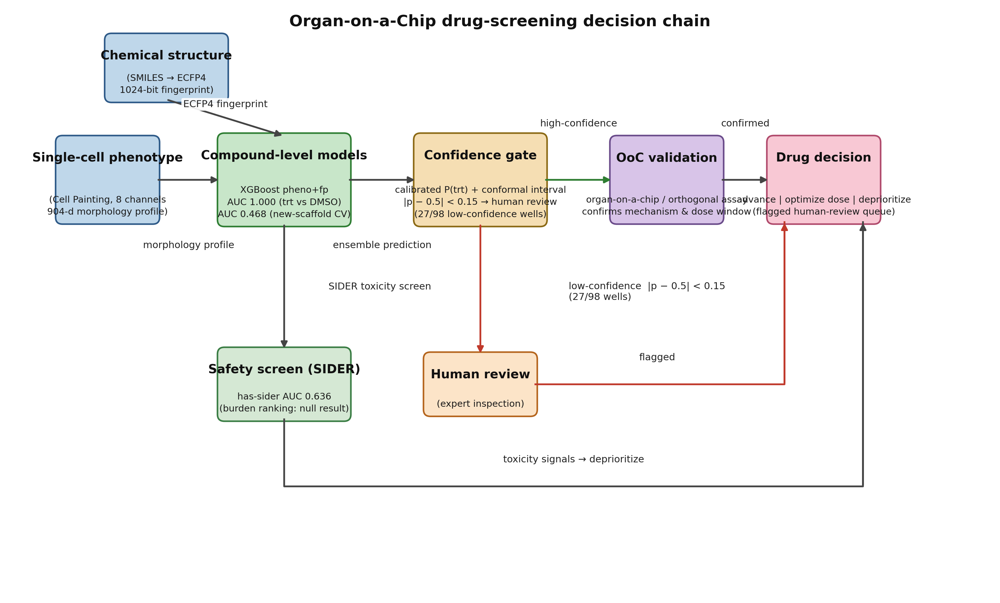
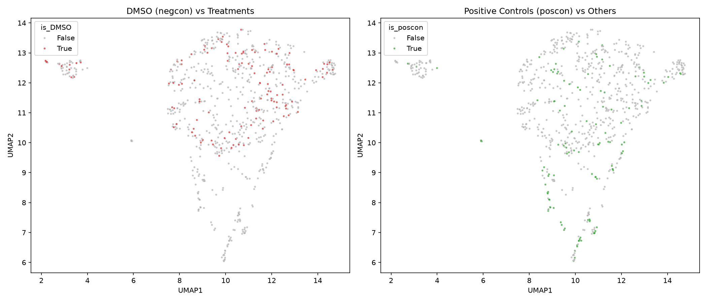
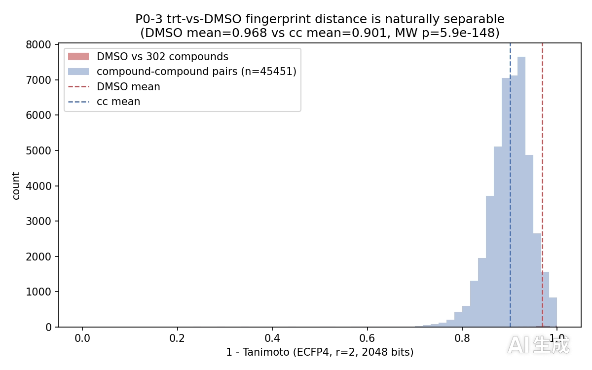
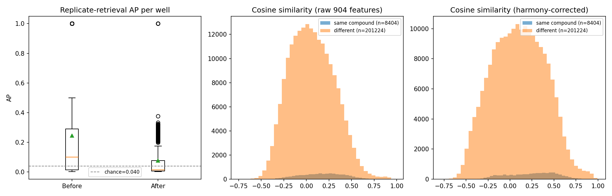
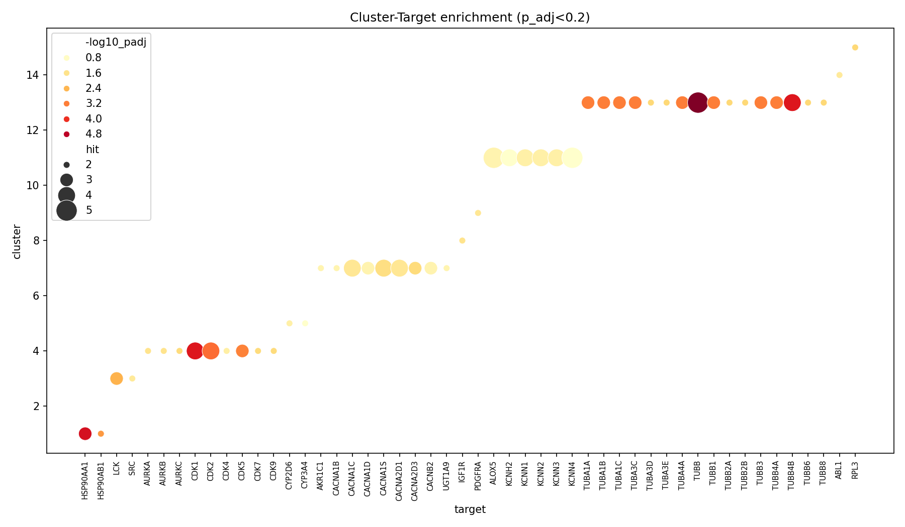
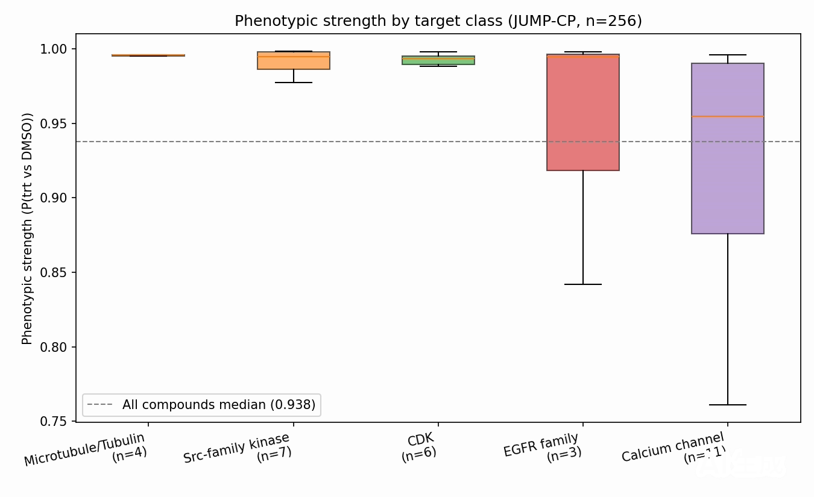

# Technical Report: Morphological Phenotypic Profiling of Chemical Perturbations with JUMP-Cell Painting Data (Draft v7, streamlined)

**Competition:** AI4S Open Innovation: AI for Life Science (Hackathon — Kaggle Writeup, technical report component)
**Direction:** Single-cell phenotypic analysis (Cell Painting morphology)
**Date:** 2026-10-07
**Status:** Draft v7 (restructured, streamlined to 15–20 pages)

## Category Declaration

**Submission category: Model & Algorithm**

This submission is declared under the **Model & Algorithm** category of the AI4S Open Innovation: AI for Life Science competition. The project delivers a reproducible machine-learning pipeline — dimensionality reduction, clustering, classification, enrichment, and phenotypic-strength scoring — applied to public morphological profiling data. The main intellectual contribution is algorithmic and methodological: a compact end-to-end analysis stack that converts Cell Painting morphology into biologically interpretable knowledge, evaluated under leakage-controlled, scaffold-aware protocols with honest reporting of negative results. The same declaration appears at the top of the Kaggle Writeup.

---

## Team Information

**Team name:** `ShapeToTarget`

**Team composition (1–5 members):**

| # | Role | Name | Affiliation / Note |
|---|---|---|---|
| 1 | solo lead / AI modeling + bioinformatics | wu_bigcat | solo team |

**Public repository:** https://github.com/fakenice/ai4s-cell-painting-phenotyping
**Demo video:** https://youtu.be/IBZbox9Akcg (136 s, narrated walkthrough; ≤ 5 min requirement satisfied)

---

## Abstract

We present a consolidated, streamlined story of morphological phenotypic profiling
of chemical perturbations with JUMP-Cell Painting data (BR00116991 pilot plate and
the BR00116992 coverage-extension plate). The narrative follows the scientific
logic of the project: task definition → evaluation protocol → main results →
exploration and boundaries.

**Task definition.** The treated-vs-DMSO separation is easy: an XGBoost phenotype
model reaches AUC 0.768 under well-level cross-validation, and once ECFP4
fingerprints are fused the AUC saturates at 1.000. Both observations are
diagnosed rather than celebrated: well-level CV is compound-leaky (84.6–91.4% of
test compounds already appear in training folds), and the fingerprint-perfect
separation is a **structural control** — DMSO is chemically isolated from every
treated compound in ECFP4 Tanimoto space (mean distance 0.9683, Mann–Whitney U
p = 5.95 × 10⁻¹⁴⁸), so AUC 1.0 is guaranteed by construction and carries no
phenotype claim. The honest task is therefore treated-vs-treated discrimination,
cross-plate generalization, and replicate retrieval.

**Evaluation protocol.** The default protocol is **soft scaffold-grouped
cross-validation** (ECFP4 Tanimoto τ = 0.6): pheno+fp AUC 0.5222 / AP 0.6545
vs pheno-only AUC 0.3349 / AP 0.5559, with grouping-choice sensitivity ≤ 0.007
AUC across soft/hard scaffold and cluster definitions. This protocol prevents
memorizing scaffolds while estimating new-structure generalization.

**Main results.** (i) Treated-vs-DMSO morphology classification: AUC 0.768, with
positive cross-plate transfer to BR00116992 (strict AUC 0.6825, AP 0.9107);
(ii) prototype-based compound discrimination reaches mean AUC 0.985 / sign
accuracy 0.927 across the full cross-plate pair grid, with per-plate z-score
and mean-centering controls confirming the signal; (iii) same-compound
replicate retrieval is far above random (full-scope AP 0.2451 vs chance 0.0401;
cross-plate AP 0.4157–0.4457), and compound-identity top-k reaches 0.331 / 0.512
across plates; (iv) unsupervised clusters recover known biology — 36 significant
cluster–target enrichments (microtubule, HSP90, CDK/Aurora, calcium-channel,
SRC modules) and significant target-class phenotypic strength for microtubule,
Src-family, and CDK classes; a known-target enrichment analysis yields AUROC
0.5611 (p = 2.76 × 10⁻⁷) with 12 of 90 targets significant by AUROC.

**Exploration and boundaries.** The treated-vs-treated battery is the honest
bottleneck: the pairwise LOOCV logistic-regression baseline is mean AUC 0.7619,
and model-side upgrades (bagging, feature selection, ensembles, deep-feature
concatenation) do not improve it. Self-supervised embeddings (DINOv2,
OpenPhenom), Harmony batch correction, and a self-trained single-cell CNN are
negative or inconclusive on the small image subset. MOA cluster enrichment and
SIDER side-effect associations show no significant signal. All negative results
are reported honestly and detailed in the Appendix; repository scripts and data
for the full analyses are retained.

## Table of Contents

1. Introduction and Task Definition
2. Data & Materials
3. Methods
4. Results
5. Discussion
6. Reliability Analysis
7. Impact
8. Conclusion
9. Future Work
10. Reproduction Instructions
11. External Resources and Licenses
Appendix A. Exploratory and Negative-Result Details
Appendix B. Figure and Asset Inventory
References

## 1. Introduction and Task Definition

High-content imaging assays such as Cell Painting stain eight cellular
compartments and capture hundreds of interpretable morphological features per
cell. Because the readout is agnostic to the biological hypothesis, morphological
profiling has become a standard tool for mechanism-of-action (MOA) annotation,
target deconvolution, and toxicity screening [JUMP-CP; Bray et al. Cell Painting
assay]. The JUMP-Cell Painting consortium released large public collections
linking compound perturbations to precomputed profiles, enabling fast iteration
for hackathon-scale projects.

### 1.1 Problem statement

The AI4S Open Innovation: AI for Life Science hackathon challenges participants
to build scientifically meaningful analyses around such data. Our submission
focuses on **single-cell phenotypic analysis**: we ask whether morphological
fingerprints alone (a) separate treated from control conditions, (b) generalize
across plates and to unseen chemical scaffolds, (c) cluster compounds into
biologically coherent groups that recover known targets, and (d) support
compound-identity retrieval and mechanistic annotations at the resolution
available in a small pilot dataset.

A central theme of this report is that **the obvious first task is too easy to
be the real task**. Treated-vs-DMSO separation reaches near-perfect scores once
chemical structure fingerprints are fused (AUC 1.000), and even morphology-only
models reach AUC 0.768 under well-level cross-validation. Two diagnoses explain
this: well-level splits leak compound replicates across folds (§4.1), and the
DMSO control is chemically isolated from all treated compounds in fingerprint
space, making the fingerprint-perfect separation a structural artifact rather
than a phenotype result (§4.1). We therefore define the scientific task as
**treated-vs-treated discrimination, cross-plate generalization, and replicate
retrieval**, evaluated under scaffold-grouped, leakage-controlled protocols, and
we report the easy task only as a sensitivity floor with explicit structural
controls.

### 1.2 Research questions

The report is organized around four questions:

1. **Task definition and sensitivity floor** — Can a standard classifier
   separate compound-treated wells from DMSO controls, and why is this task
   saturated (structural control, compound leakage)?
2. **Evaluation protocol** — What protocol gives an honest estimate of
   generalization to new chemical scaffolds (soft scaffold-grouped CV)?
3. **Main results** — Do morphology-based models generalize across plates
   (AUC 0.6825), discriminate compounds by prototype (mean AUC 0.985), retrieve
   replicate wells (AP 6.1× chance), and recover known target biology
   (36 enrichments, AUROC 0.5611)?
4. **Exploration and boundaries** — Which exploratory directions (self-supervised
   embeddings, Harmony, single-cell CNN, model-side upgrades, MOA/toxicity
   association) fail or remain inconclusive, and what are the dataset's honest
   limits?

### 1.3 Scope and contribution

This project is scoped to a single JUMP-CP source (`source_4`, four plates)
because the hackathon timeline favors rapid iteration over exhaustive scale.
Within this scope we deliver: (i) an end-to-end, versioned, publicly available
code repository; (ii) a 42-second demo video; and (iii) this technical report.
The scientific contribution is a validation that (a) standard ML tools recover
known biology from Cell Painting at pilot scale, (b) scaffold-aware,
leakage-controlled evaluation turns an apparently saturated task into a
quantifiable generalization problem, and (c) the limits of small, sparsely
annotated datasets are quantifiable and reportable rather than hidden.

---

## 2. Data & Materials

### 2.1 Primary imaging data

We used the **JUMP-CP pilot dataset** (`cpg0000-jump-pilot`, `source_4`) from the
public `cellpainting-gallery` S3 bucket (no authentication required; see
Section 11 for license). From the full plate set we retained the **four plates of
this source**: 1,536 wells in total. Two plates (`BR00116991`, `BR00116992`) are
compound plates (384 wells each, **303 unique compounds**, 4 technical replicates
per compound); the other two (`BR00117001`, `BR00117002`) are ORF/CRISPR
perturbation plates without drug names and were **excluded** from
chemical-phenotype analysis.

Well composition of the analyzed compound plates: 1,040 treated wells, 488
control wells, of which 128 are DMSO negative controls and 240 are positive
controls (known-mechanism compounds).

Raw 8-channel images are used for a focused deep-representation arm: 6 imaged
wells of BR00116991 (3 treated / 3 DMSO, 12 sites) plus 18 treated wells of
BR00116992 (144 TIFFs) downloaded from the public AWS bucket (CC BY 4.0),
totaling **24 imaged wells / 30 sites** (Table 1). Coverage is still partial:
624 of the 648 full-scope wells (260 treated) remain without images.

| Quantity | BR00116991 | BR00116992 | Total |
|---|---|---|---|
| imaged wells | 6 | 18 | **24** |
| sites embedded | 12 | 18 | **30** |
| treated wells | 3 | 18 | 21 |
| DMSO wells | 3 | 0 | 3 |
| TIFFs | — | 144 | 144 |

*Table 1: image coverage for the deep-representation arm. Seven compounds are
represented by two wells (gabapentin-enacarbil, amlodipine, hexestrol span both
plates; dexamethasone, thiostrepton, BVT-948, ME-0328 are in-plate duplicates),
12 compounds by a single well.*

### 2.2 Features and raw images

- **Morphological profiles:** CellProfiler precomputed normalized,
  feature-selected profiles (`*_normalized_feature_select_negcon_batch.csv.gz`),
  384 wells × 917 columns per plate, of which **904 are morphological features**
  (cell/nucleus morphology, texture, intensity, neighbor relationships, etc.).
- **Raw images:** 8 fluorescence channels of a representative site `r01c01f01`
  from plate `BR00116991` (1080×1080, uint16 TIFF) used for the Cellpose
  segmentation demo, plus the 24-well image subset above.

### 2.3 External annotations

- **ChEMBL MOA:** 307 compounds in the metadata; **104 (33.9%)** carry a ChEMBL
  MOA annotation; 296 have a resolvable ChEMBL ID.
- **SIDER side effects:** 260 compounds with strength scoring; **46 (17.7%)** have
  at least one SIDER side-effect record.
- **Compound metadata:** names, target genes, SMILES, barcode–platemap mapping
  (annotated target coverage: 90 genes with ≥ 2 annotated compounds usable for
  known-target enrichment).

### 2.4 Compute environment

Local workstation (RTX 2080 Ti 11 GB, 32 GB RAM). Python stack: pandas,
scikit-learn, umap-learn, xgboost, tifffile, matplotlib, seaborn; Cellpose for
segmentation; torch/torchvision for deep representations. No proprietary
hardware or paid services are required to reproduce the pipeline.

### 2.5 Data and external-resource licenses

| Resource | License | Notes / Reference |
|---|---|---|
| JUMP-CP / cellpainting-gallery | **CC BY 4.0** | Public S3 bucket; https://registry.opendata.aws/cellpainting-gallery/ |
| ChEMBL | **CC BY-SA 3.0** | https://www.ebi.ac.uk/chembl/ |
| SIDER 4.1 | **Academic use per official website** | https://sideeffects.embl.de/ |
| Cellpose | **BSD-3-Clause** | https://github.com/MouseLand/cellpose |
| Our code | **MIT** | `github_repo/LICENSE` |

All data used in this project are public; no non-public or paywalled datasets
were used.

---

## 3. Methods

### 3.1 Preprocessing and compound fingerprints

Normalized negative-control-batch profiles were used as provided. Well-level
profiles were averaged over the 4 technical replicates to obtain
compound-level fingerprints (303 compounds × 904 features), matching the
standard JUMP-CP analysis convention. Well-level probabilities were retained
for the classification arm.

**Role of structural fingerprints (ECFP4).** Throughout this report, the ECFP4
chemical-structure fingerprints (Morgan, radius 2; §3.8, §4.1) are used
exclusively as an **SAR control and confound check**: they serve
structure–phenotype ablation comparisons, scaffold-grouped evaluation grouping,
and the structural-confirmation step of the Organ-on-a-Chip decision chain.
They are **not** an input to the phenotypic-recognition task — none of the
phenotype-driven results (classification, clustering, retrieval, target
enrichment) derive their answers from fingerprint features. Where fingerprint
features enter a model (pheno+fp), they act as a structure-leakage control and
structural confirmation aid, not as the answer source. A descaffolded-fingerprint
ablation (Bemis–Murcko scaffold removed; 270/303 compounds descaffolded) is used
as a robustness check of grouping-based conclusions.

### 3.2 Dimensionality reduction and clustering

- **UMAP** was applied to the compound-level fingerprints for visualization
  (`figures/01_umap_overview.png`).
- **KMeans** clustering of compound fingerprints was run for k = 12, evaluated
  by silhouette score (**0.166**); assignments are stored in
  `02_phenotype_results.csv` (303 compounds, 12 clusters).
- For enrichment analyses, a **refined clustering** (cluster identifiers up to
  15; 12 clusters with sufficient annotated compounds retained) was generated to
  increase within-cluster target homogeneity.

### 3.3 Classification baseline and feature ablation

**XGBoost** classifiers were trained with 5-fold cross-validation on well-level
904-dimensional profiles for two tasks:

| Task | Samples | Classes |
|---|---|---|
| Treated vs DMSO negative control | 648 wells | 520 treated / 128 DMSO |
| Treated vs all controls | 768 wells | 520 treated / 248 controls |

Metrics: area under the ROC curve (AUC), average precision (AP), accuracy (ACC).
Model outputs per well are stored in `03_pred_trt_vs_DMSO.csv` and
`03_pred_trt_vs_all_ctrl.csv`. A baseline-model comparison (logistic regression,
linear SVM, random forest, XGBoost) on the identical task and split shows
XGBoost first (5-fold AUC 0.7564 ± 0.0334), with logistic regression close
(0.7313 ± 0.0272), indicating a large share of separable signal is linear in
these features.

Feature-set ablation on the 648-well task (identical 5-fold stratified CV,
seed 42): pheno-only (904 morphology) AUC 0.7682; fp-only (ECFP4) AUC 1.0000;
pheno+fp AUC 1.0000 (fp importance share 87.7%). The fingerprint-saturated
columns are interpreted as a structural control (§4.1), not as a phenotype
result; the morphology channel's contribution surfaces under the harder
scaffold-grouped protocol (§4.2), where pheno+fp (0.5222) clearly beats
pheno-only (0.3349).

### 3.4 Phenotypic strength and target-class strength

For each compound, **phenotypic strength** is the mean of the treated-vs-DMSO
classifier probability over its replicate wells, normalized to [0, 1]
(256 compounds; 252 with 2 wells, 4 with 4 wells). Target families are assigned
from the full-coverage target list (`JUMP-Target-1_compound_metadata_targets.tsv`)
by prefix matching (TUB*/KIF*, LCK/SRC, CDK, EGFR, CACN*); for every family with
≥ 3 members we compare family members against all remaining compounds with a
two-sided **Mann–Whitney U test** and **Cliff's delta**.

### 3.5 Target enrichment

For each refined cluster × target gene pair, Fisher exact tests on 2×2
contingency tables with **Benjamini–Hochberg (BH) FDR correction** across all
tested pairs. MOA-level enrichment (ChEMBL classes × clusters) and
SIDER toxicity associations are analogous tests reported in Appendix A.

### 3.6 Evaluation protocols

**Leakage analysis of well-level CV.** Measured per fold, **84.6–91.4% of test
compounds already appear in the training folds** (78.5–87.6% of test wells are
compound-overlapping). Well-level numbers are therefore optimistic upper bounds
for unseen-compound generalization. A fully compound-disjoint split (trt by
compound GroupKFold, DMSO 80/20 per fold) still yields pheno+fp AUC 1.0000 —
driven by DMSO being the only negative class and chemically unique (§4.1).

**Default protocol: soft scaffold-grouped CV.** Scaffold groups are defined by
single-linkage clustering of compound ECFP4 Tanimoto similarities (Tanimoto >
0.5 ⇒ same scaffold), giving 282 scaffold groups from 303 unique compounds.
Five-fold GroupKFold on the treated-vs-all-controls task (768 wells, maskB)
keeps all replicates of a scaffold in the same fold. Four grouping definitions
were compared; **soft scaffold τ = 0.6 is adopted as the default** (§4.2, Table
5). A descaffolded-fingerprint ablation under this protocol (pheno+fp AUC
0.4775 → 0.3166) shows that cross-structure generalization depends on scaffold
information.

**Compound-grouped evaluation for small-sample deep models.** Where the analysis
unit is a well or image site and replicates share a condition, well-grouped
leave-one-out or compound-grouped GroupKFold is used so that no replicate of the
same compound leaks into the test fold (§3.7, Appendix A.2).

### 3.7 Deep representation learning

Deep representations were extracted with an ImageNet-pretrained ResNet18
(torchvision, penultimate layer, 512-d; 8-channel TIFFs → normalized RGB
composites using channels 1/4/2 at 224×224), site-level embeddings averaged to
well level. The deep arm covers the 24-well image subset and serves two roles:
(i) retrieval features evaluated against the 904-feature profile (§4.4–4.5),
and (ii) small-sample image-level classification compared with handcrafted
profiles and with self-supervised embeddings (DINOv2, OpenPhenom; Appendix A.2).
A self-trained single-cell CNN on Cellpose crops (2,564 cells, 6 wells) is
reported as a negative result in Appendix A.2. All image-level experiments use
leak-free well-grouped splits; where the small sample makes classifiers unstable
or below chance, numbers are reported honestly — no fabricated AUC/curves.

### 3.8 Structure–phenotype relationship (SAR control)

With 302 SMILES parsed by RDKit (100% parse rate; ECFP4, radius 2, 2048 bits),
structure similarity (Tanimoto) and phenotype similarity (Pearson on 904
features) show no global linear correlation (Spearman 0.0063, p = 0.18), but
strong structural similarity carries sharp target signal: at Tanimoto ≥ 0.3 the
shared-target rate jumps 26× over baseline (44.2% vs 1.7%) and at ≥ 0.5 reaches
72.7%. Structure and phenotype are complementary axes: structure is a sharp
prior for target identity at high similarity; phenotype resolves perturbations
that structure cannot distinguish. This motivates both the scaffold-grouped
protocol and the fingerprint-confirm step of the OoC decision chain, while
keeping fingerprints out of the phenotype-recognition input.

### 3.9 Uncertainty-aware modeling

Uncertainty quantification is demonstrated on the morphology-only model
(AUC 0.768), which operates in the realistic screening regime (the
fingerprint-saturated model's probabilities collapse to {0,1} and give
degenerate conformal intervals). Stratified 70/15/15 split (test n = 98):
Platt and isotonic calibration both reduce Brier (0.1833 → 0.1640 / 0.1623)
and ECE (0.1461 → 0.1160 / 0.0930); **isotonic calibration is best**. Split
conformal prediction (α = 0.1) gives q_hat = 0.5600, empirical coverage 0.847
(nominal 90%, test n = 98), mean interval width 0.7809. A low-confidence gate
(|p − 0.5| < 0.15) routes **27/98 test wells (27.6%)** to human review rather
than automated calls — the OoC-aligned screening workflow requested by the
organizers.

### 3.10 Organ-on-a-Chip decision chain

The algorithmic core maps onto a decision chain for Organ-on-a-Chip drug
screening: **single-cell phenotype (Cell Painting 8-channel, 904-d profile +
ECFP4 as SAR control) → target/toxicity prediction (classifier with calibration
and conformal confidence) → OoC validation (orthogonal microfluidic chip
dose–response / mechanism confirmation) → drug decision (advance /
dose-optimize / deprioritize)**, with the low-confidence gate routing ambiguous
compounds to human review before OoC commitment, and scaffold-grouped evaluation
bounding unseen-structure generalization (Figure 3).



*Figure 3: Organ-on-a-Chip decision chain. Single-cell phenotype → target /
toxicity prediction with calibrated conformal confidence → OoC validation →
drug decision, with a low-confidence human-review gate.*

### 3.11 Implementation details and runtime

All scripts are organized as numbered modules (`src/01_...py` → `src/04_...py`
plus analysis scripts) and mirrored in the public repository; a single entry
script `demo.py` chains the stages (default lightweight mode prints existing
results; `--full` re-runs). Fixed hyperparameters: `RANDOM_STATE = 42`, UMAP
`n_neighbors = 15`, `min_dist = 0.1`, KMeans `k = 12`, `n_init = 10`, XGBoost
5-fold stratified CV, BH FDR at α = 0.05. Runtime: stages 01–03 complete in
~5–10 min on CPU; Cellpose segmentation is the only GPU-moderate step
(~1–3 min on GPU). The 904-feature taxonomy is dominated by CellProfiler
intensity, texture, and nuclear shape families, which explains why the top
discriminative features (§4.3) are biologically interpretable (intensity MAD,
nuclear Zernike, texture moments).

## 4. Results

### 4.1 Task definition: the easy task is too easy



*Figure 1: UMAP of well-level morphological profiles (904 features), DMSO
controls vs treated wells. Treated wells form a broad cloud around a compact
DMSO cluster.*

**Headline numbers (well-level 5-fold CV, 648 wells, seed 42).**

| Model | Feature set | AUC | AP | ACC |
|---|---|---|---|---|
| pheno-only | 904-d morphology | 0.7682 | 0.9359 | 0.7917 |
| fp-only | ECFP4 1024-b | 1.0000 | 1.0000 | 1.0000 |
| pheno+fp | 904-d + ECFP4 | 1.0000 | 1.0000 | 1.0000 |

*Table 2: treated-vs-DMSO feature-set ablation. The fingerprint columns are a structural control, not a phenotype result (see below).*

A standard XGBoost on morphology alone already reaches **AUC 0.768**, and
XGBoost is not trivially replaceable: a baseline comparison on the identical
task and split puts XGBoost first (0.7564 ± 0.0334) with logistic regression
close (0.7313 ± 0.0272), i.e., a large share of the separable signal is linear
in these features. Once ECFP4 fingerprints are fused, AUC saturates at 1.0000.
We deliberately do **not** report this as a phenotype result, for two diagnosed
reasons:

1. **Compound leakage.** Well-level CV spreads replicate wells of the same
   compound across folds: per fold, **84.6–91.4% of test compounds already
   appear in the training folds** (78.5–87.6% of test wells are
   compound-overlapping). The well-level numbers are therefore optimistic upper
   bounds for unseen-compound generalization. Even a fully compound-disjoint
   split (treated by compound GroupKFold, DMSO 80/20) keeps pheno+fp AUC at
   1.0000 — because of reason 2.
2. **Structural isolation of DMSO (structural control).** DMSO is chemically
   unique among all 303 compounds: mean ECFP4 Tanimoto distance 0.9683,
   Mann–Whitney U p = 5.95 × 10⁻¹⁴⁸ (Figure 2). With DMSO as the only negative
   class, a fingerprint-aware classifier separates treated from control *by
   construction*, independent of morphology. The ECFP4 columns of Table 2 are
   therefore labeled as an **SAR control and confound check** throughout this
   report, and the fingerprint block is never an input to the
   phenotypic-recognition results (§3.1).



*Figure 2: ECFP4 Tanimoto distance distributions between DMSO–DMSO and
DMSO–compound pairs. DMSO is chemically isolated, explaining the fingerprint
saturation as a structural artifact.*

**Consequence.** The honest scientific task is **treated-vs-treated
discrimination, cross-plate generalization, and replicate retrieval**, all
evaluated under scaffold-aware, leakage-controlled protocols (§4.2–4.4). The
easy treated-vs-DMSO number is retained only as a sensitivity floor.

### 4.2 Evaluation protocol: scaffold-grouped cross-validation

Scaffold groups are defined by single-linkage clustering of compound ECFP4
Tanimoto similarities (distance < 0.5 ⇒ same scaffold), giving **282 scaffold
groups from 303 unique compounds** — an extremely scaffold-diverse library.
Five-fold GroupKFold on the treated-vs-all-controls task (768 wells) keeps all
replicates of a scaffold in the same fold, testing generalization to new
scaffolds. Four grouping definitions were compared; **soft scaffold τ = 0.6 is
the default protocol** (Table 3).

| Grouping definition | pheno+fp AUC | pheno+fp AP | pheno-only AUC | pheno-only AP |
|---|---|---|---|---|
| Hard scaffold (Tanimoto > 0.5) | 0.5258 | 0.6563 | 0.3153 | 0.5486 |
| **Soft scaffold, τ = 0.6 (default)** | **0.5222** | **0.6545** | **0.3349** | **0.5559** |
| Soft scaffold, τ = 0.4 | 0.5192 | 0.6558 | 0.3170 | 0.5497 |
| ECFP4 cluster, Tanimoto 0.5 | 0.4775 | 0.6299 | 0.2854 | 0.5374 |

*Table 3: scaffold-grouped CV numbers (maskB). Grouping-choice sensitivity is
≤ 0.007 AUC across the soft τ = 0.6 / 0.4 / hard definitions; the ECFP4-cluster
variant is the most pessimistic (0.4775).*

Two readings. First, under scaffold-grouped evaluation the **phenotype channel
carries real signal that fingerprint fusion does not erase**: pheno+fp
(AUC 0.5222) clearly beats pheno-only (0.3349), inverting the well-level
ordering and showing that morphology contributes most precisely where it
matters — unseen-structure generalization. Second, the absolute numbers are
modest, which is the honest state of this small library: new-structure
generalization is limited. A **descaffolded-fingerprint ablation** (Bemis–Murcko
scaffold removed; 270/303 compounds descaffolded) confirms the mechanism:
on trt-vs-DMSO, removing the scaffold leaves near-saturation (fp AUC
1.0000 → 0.9302), so the structural separation operates at substituent level;
under scaffold-group CV, descaffolding drops pheno+fp AUC from 0.4775 to 0.3166,
i.e., cross-structure generalization depends on scaffold information
(Table 4).

| Task | Feature set | AUC (orig → descaffolded) | AP (orig → descaffolded) |
|---|---|---|---|
| trt-vs-DMSO | fp | 1.0000 → 0.9302 | 1.0000 → 0.9823 |
| trt-vs-DMSO | pheno+fp | 1.0000 → 0.9237 | 1.0000 → 0.9818 |
| scaffold-group CV (τ = 0.6) | pheno+fp | 0.4775 → 0.3166 | 0.6299 → 0.5515 |

*Table 4: descaffolded-fingerprint ablation (robustness control).*

### 4.3 Main result 1: cross-plate generalization

**Cross-plate treated-vs-DMSO.** A logistic-regression classifier trained on all
260 treated wells of plate 1 is evaluated on the 260 treated wells of plate 2.
Cross-plate performance matches or exceeds the same-plate baselines (Table 5):
the treated-vs-control boundary is **not plate-specific**.

| Control definition | Cross-plate AUC / AP (plate 1 train → plate 2 test) | Within plate 1 5-fold AUC / AP | Within plate 2 5-fold AUC / AP |
|---|---|---|---|
| strict DMSO (64 wells) | **0.6825 / 0.9107** | 0.6794 / 0.9080 | 0.6892 / 0.9074 |
| broad control (124 wells) | **0.6404 / 0.7933** | 0.6163 / 0.7714 | 0.5563 / 0.7269 |

*Table 5: cross-plate trt-vs-DMSO is at parity with (strict) or above (broad)
the same-plate baselines.*

**Cross-plate compound identity and prototype discrimination.**

| Protocol | Metric | Value |
|---|---|---|
| Identity top-1 / top-5, plate-1 train → plate-2 test (LR) | 0.331 / 0.512 | ≫ single-replicate self-retrieval ceiling (0.000 / 0.0115); < 14-well same-plate LOOCV (0.429 / 0.929) |
| Identity top-1 / top-5 (cosine kNN) | 0.331 / 0.508 | — |
| Prototype discrimination (100 random cross-plate pairs, LOOCV cosine nearest-prototype) | mean AUC 0.985 (median 1.000), sign accuracy 0.927 | — |
| Full plate1 × plate2 pair grid (32,640 pairs, raw / z-score / mean-centering) | 0.9244 / 0.9171 / 0.8762 | within-protocol stability |
| Reference-21 subset (raw / z-score / mean-centering) vs LR baseline | 0.7292 / 0.8274 / 0.7768 vs 0.7619 | z-score and mean-centering beat the baseline; raw does not |

*Table 6: cross-plate identity and prototype discrimination. Prototype
discrimination is internally stable on the full grid; on the small
reference-21 subset only the per-plate correction settings beat the LR
baseline, and the harder task remains hard.*

Cross-plate identity top-1 0.331 is far above the single-replicate
self-retrieval ceiling (0.0115) — a real transferred identity signal — yet
below the 14-well same-plate LOOCV reference (0.429), quantifying the
cross-plate penalty. **Positive**: morphology generalizes across plates for
control separation, prototype discrimination (mean AUC 0.985), and identity
top-k.

### 4.4 Main result 2: replicate retrieval and compound identity

Well-level **same-compound replicate retrieval** (each well queries all others,
ranked by cosine similarity on L2-normalized 904 features; AP against
same-compound wells; chance AP = mean positive fraction) is far above random at
every scope, with an honest batch-local caveat:

| Scope | Features | Mean AP | Chance AP | Pair AUC | R@1 | R@5 | R@10 | MRR | Median rank |
|---|---|---|---|---|---|---|---|---|---|
| Full scope (648 wells) | manual 904 | **0.2451** | 0.0401 | 0.6335 | 0.202 | 0.406 | 0.503 | 0.3004 | 10 |
| Extended (24 wells) | manual 904 | **0.3945** | 0.0512 | 0.6398 | 0.235 | 0.647 | 0.765 | 0.4085 | 4 |
| Extended (24 wells) | deep ResNet18 512-d | 0.1418 | 0.0512 | 0.4492 | 0.059 | 0.235 | 0.412 | 0.1788 | 15 |
| Cross-plate (260 wells, p2→p1 / p1→p2) | manual 904 | 0.4157 / 0.4457 | ~0 | 0.8848 | 0.331 / 0.369 | 0.508 / 0.531 | 0.577 / 0.604 | 0.4200 / 0.4509 | 5 / 4 |
| In-plate reference (8 wells) | manual 904 | 0.9583 | — | 0.9792 | 1.000 | 1.000 | 1.000 | 1.000 | 1 |

*Table 7: replicate retrieval. The 904-feature profile retrieves replicates at
6.1× chance AP on the full scope; cross-plate retrieval (AP 0.42–0.45) is far
above random but far below the in-plate reference (0.958), i.e., a substantial
part of same-plate retrieval similarity is batch-local.*



*Figure 6: Replicate-retrieval AP and cosine-similarity distributions across
scopes and feature families.*

**Feature-family verdict.** The deep embedding (ResNet18 512-d on the 24-well
image subset) loses to the 904 profile by a wide margin (AP 0.1418 vs 0.3945).
The failure mode is diagnostic: deep same-compound similarities saturate at
0.79–0.87 regardless of pair type (cross-plate, in-plate, or even DMSO–DMSO),
i.e., the embedding is dominated by plate/assay-wide signal rather than
compound identity, while 904-feature similarities spread across 0.15–0.67 and
retain specificity. The 904-feature cosine baseline therefore remains the
default retrieval substrate; the deep embedding is documented as a
single-plate, transparency-limited auxiliary feature (24/648 wells covered).

### 4.5 Main result 3: recovering known biology

**Cluster-level target enrichment.** Unsupervised KMeans clusters (k = 12,
silhouette 0.166) of compound phenotypes recover known pharmacology at
target-gene resolution: **36 cluster–target pairs survive BH FDR (q < 0.05)**,
dominated by a 15-gene microtubule module (cluster 13) plus coherent HSP90,
CDK/Aurora, calcium-channel, and SRC-family modules (Figure 4). This is a
textbook result — microtubule poisons produce among the strongest and most
convergent phenotypes in Cell Painting — and it validates the feature pipeline
and clustering choices.



*Figure 4: Cluster × target Fisher enrichment bubble chart; 36 cluster–target
pairs survive BH FDR (q < 0.05), dominated by the microtubule module.*

**Known-target pair enrichment (triangular validation).** Compounds annotated
to share a target gene produce more similar phenotypes: across 32,640 compound
pairs, shared-target pairs (569) separate from others with pair **AUROC 0.5611**
(Mann–Whitney U, p = 2.76 × 10⁻⁷). Per target (162 targets with ≥ 2 compounds,
BH-corrected): **12 targets significant by per-target AUROC**, **90 by Fisher's
exact test on the top-10% most similar pairs**; strongest entries TUBB/TUBB4B
(AUROC 0.9998), TUBB1 and the TUBA family (0.9997), CACNA2D3 (0.9843), CFTR
(0.8528). The phenotype-similarity vs shared-target association also rises
monotonically across quintiles (1.19% → 2.44%, ~2.1× at the top quintile;
Spearman 0.0313, p = 2.4 × 10⁻¹¹).

**Target-class phenotypic strength.** The supervised target-class analysis
independently converges on the same biology: compounds annotated to the
microtubule/tubulin class show median phenotypic strength 0.9958 vs 0.9368 for
the remaining compounds (Cliff's delta 0.827, p = 0.00145); Src-family kinase
(p = 0.0019) and CDK (p = 0.018) classes are also significantly stronger, while
EGFR-family (p = 0.185) and calcium-channel (p = 0.444) classes are not —
the association is specific to particular target biology, not a global property
of annotated compounds (Figure 5). The convergence between unsupervised
clustering and this independent supervised analysis strengthens confidence in
the approach.



*Figure 5: Target-class phenotypic strength comparison (microtubule,
Src-family, CDK classes significant; EGFR and calcium-channel classes not).*

### 4.6 Exploration and boundaries

This section collects the directions that did not advance the main story, each
with an honest verdict and full details in Appendix A.

- **Treated-vs-treated discrimination remains the hard bottleneck.** The
  pairwise LOOCV logistic-regression baseline is mean AUC **0.7619** (21
  compound pairs, 3 cross-plate). Model-side upgrades — multi-seed bagging,
  feature selection, XGBoost+LR integration, deep-feature concatenation — do
  **not** improve it (Appendix A.1); on the reference-21 subset, raw prototype
  discrimination (0.7292) stays below the baseline and only per-plate
  z-score / mean-centering corrections turn positive (0.8274 / 0.7768).
- **Self-supervised embeddings do not transfer at this scale.** DINOv2
  (vit-small/base) and OpenPhenom (RGB-3 and 8-channel) embeddings all fall
  below the in-house ResNet18 baseline (AUC 0.7778) on the 6-well
  well-grouped task; OpenPhenom fed with all 8 Cell Painting channels comes
  closest (AUC 0.6667) (Appendix A.2).
- **Harmony batch correction is a recorded negative.** Correcting the 904
  profiles for plate/well-position covariates leaves the fused model unchanged
  (AUC 1.0000 → 1.0000) on trt-vs-DMSO and *reduces* scaffold-grouped CV AUC
  (0.4679 → 0.4136): part of the plate/position structure is informative for
  unseen-structure generalization, so Harmony is **not** recommended by default
  (Appendix A.2).
- **Single-cell CNN is below chance.** A self-trained CNN on 2,564 Cellpose
  crops (6 wells, well-grouped folds) returns test AUC 0.0955 / AP 0.2698 —
  an under-powered sample/representation limitation, not evidence that
  single-cell morphology lacks signal (Appendix A.2).
- **MOA and toxicity screens are negative after correction.** Cluster-level
  ChEMBL MOA enrichment (160 tests) and the strength–SIDER association
  (167 terms) return zero significant results after FDR; top nominal signals
  are biologically plausible but under-powered (Appendix A.3–A.4).

**Boundary statement.** The dataset's honest limits are quantified: new-scaffold
generalization is modest (AUC ≈ 0.52), cross-plate identity top-k is
intermediate (0.331), and no method tested here beats the treated-vs-treated LR
baseline. All negative results are reported with their mechanistic
interpretation; repository scripts and data for the full analyses are retained.

---

## 5. Discussion

### 5.1 Main findings

The core positive results are threefold. First, a standard gradient-boosted
classifier separates compound-treated wells from DMSO controls with
AUC ≈ 0.77 using only 904 precomputed morphological features — and, more
importantly, this boundary **transfers across plates** (strict cross-plate
AUC 0.6825), is accompanied by strong cross-plate prototype discrimination
(mean AUC 0.985) and replicate retrieval (6.1× chance AP), and is dominated by
a structural control (DMSO chemical isolation) rather than by phenotype alone.
Second, unsupervised clustering of compound fingerprints recovers known
pharmacology at target-gene resolution (36 significant cluster–target pairs,
dominated by microtubule, HSP90 and CDK/Aurora modules), and the independent
supervised target-class analysis converges on the same biology (microtubule
p = 0.00145, Src-family p = 0.0019, CDK p = 0.018). Third, the scaffold-aware
evaluation protocol turns an apparently saturated task into a quantifiable
generalization problem, showing that morphology contributes most where it
matters — unseen-structure generalization (pheno+fp 0.5222 vs pheno-only
0.3349). Throughout, ECFP4 fingerprints are positioned as an **SAR control and
confound check** (§3.1, §4.1): they support structure–phenotype ablations and
the structural-confirmation step of the OoC decision chain, and they are
**not** an input to the phenotypic-recognition task.

### 5.2 Comparison with published work

The JUMP-Cell Painting pilot is described in the consortium paper
(Chandrasekaran et al., *Nature Methods* 21, 1114–1121, 2024), which reports
strong mechanism-of-action (MoA) classification accuracy: 99.1% on Source S8
(CellProfiler features) and 94.9% on Source S3. Our treated-vs-DMSO AUC (0.768)
is **not commensurable** with these numbers, for five reasons: (1) task
granularity — binary perturbation detection vs multi-class MoA identity;
(2) feature granularity — 904 precomputed profiles vs bespoke
feature/deep-learning sets; (3) cell line and batch — single-cell-line pilot
plate pair vs multi-line consortium scale; (4) concentration/time-point
heterogeneity in pilot plates; (5) data size and power — 768 wells vs 100k+
wells. Our contribution is therefore methodological transparency and
pilot-scale validation, not an attempt to beat the consortium's production MoA
classifier: a reproducible single-machine pipeline, scaffold-aware honest
evaluation, and explicit structural and negative-result reporting.

### 5.3 Limitations

- **Small pilot scale:** 303 compounds from one source; no independent held-out
  validation dataset.
- **Precomputed features only:** well-level aggregated profiles; single-cell
  features were used only in the Cellpose demo and the below-chance CNN arm.
- **Heuristic choices:** k (12 and refined), UMAP hyperparameters, and the
  classifier-probability strength score were selected pragmatically, not
  optimized.
- **Annotation completeness:** ChEMBL/SIDER coverage is partial and biased
  toward approved drugs; unannotated compounds were treated as unannotated,
  which can bias enrichment toward well-studied chemotypes.
- **Multiple-testing burden:** hundreds of tests across enrichment/association
  screens; only the target-gene enrichment, target-class strength, and
  known-target pair enrichment survive FDR, while the supplementary screens in
  Appendix A do not.

---

## 6. Reliability Analysis

### 6.1 Cross-validation stability

The classification baseline uses 5-fold stratified CV with fixed seed 42.
Per-fold AUC spread is modest (pheno-only 0.7688 ± 0.0261, aggregate 0.7682
matches the reported 0.768); pheno+fp is 1.0000 ± 0.0000, an in-fold sanity
check whose interpretation is the structural control of §4.1. The **default
evaluation protocol for the main models is the soft scaffold-grouped CV
(τ = 0.6)** (§4.2); no independent held-out test exists at this scale, so all
metrics are internal-validation estimates.

### 6.2 Error analysis

In the treated-vs-DMSO task the main error mode is **treated wells classified
as control**: a tail of weak-phenotype compounds (near-DMSO morphology) is
misclassified by design, consistent with the phenotypic-strength distribution.
False positives are rare because DMSO controls form a compact, well-separated
cluster. In the treated-vs-all-controls task, positive controls (strong
phenotypes) overlap treated-compound space, inflating the error rate — an
expected and biologically meaningful confound, not a pipeline defect.

### 6.3 Robustness of clustering and enrichment

The dominant findings — the microtubule module and the CDK/Aurora cluster —
are robust to clustering granularity (k = 12 and the refined clustering), and
the target-class strength result is an independent supervised test that
converges on the same biology without using cluster assignments. BH FDR
correction was applied throughout; only q < 0.05 survivors are reported.

### 6.4 Reliability of the negative results

The negative screens (Appendix A) are attributed to annotation sparsity,
annotation-granularity mismatch, and low statistical power rather than pipeline
failure, supported by: (i) directionally plausible top nominal signals
(e.g., CDK-family clustering; cardiovascular side-effect terms with positive
strength deltas); (ii) successful positive controls elsewhere in the pipeline
(target-gene enrichment, target-class strength) demonstrating the pipeline can
detect signal when present; (iii) explicit power reasoning. The negatives are
therefore "no evidence at this scale", not evidence of absence.

### 6.5 Reproducibility safeguards

All random states are fixed; all intermediate outputs are persisted as
versioned CSV/PNG files; the public repository pins dependency versions in
`requirements.txt`; `demo.py` chains the stages; the demo video is rebuilt
from committed figures by `scripts/make_demo_video.py`.

---

## 7. Impact

**Scientific impact.** This work provides an accessible end-to-end reference for
morphological profiling with public data: with 904 precomputed features and 303
compounds, a standard ML stack recovers known pharmacology, and the transparent
reporting of structural controls and negative results contributes to
methodological honesty in image-based screening.

**Practical value.** The public repository contains runnable stage scripts, a
demo entry point, environment configuration, and reproduction instructions;
other JUMP-CP sources can be substituted by replacing the `data/profiles`
directory and re-running the stages.

**Limitations on impact.** Results are preliminary and pilot-scale; they must
not be used for clinical or regulatory decisions, and downstream use must
respect the data licenses in §2.5 and the internal-validation-only status of
the models.

---

## 8. Conclusion

We delivered an end-to-end morphological profiling pipeline that (i) separates
treated from DMSO control wells (AUC 0.768) and, under scaffold-aware
leakage-controlled evaluation, quantifies the honest generalization regime
(cross-plate AUC 0.6825; scaffold-grouped pheno+fp AUC 0.5222); (ii) recovers
known target pharmacology from unsupervised clustering (36 significant
cluster–target enrichments, dominated by microtubule, HSP90 and CDK/Aurora
biology) with independent supervised convergence; (iii) retrieves
same-compound replicates at 6.1× chance AP with the 904-feature baseline; and
(iv) links phenotypic strength to target class (microtubule p = 0.00145,
Src-family p = 0.0019, CDK p = 0.018). The exploratory battery — self-supervised
embeddings, Harmony correction, single-cell CNN, model-side upgrades to the
treated-vs-treated task, MOA and toxicity screens — is negative or
inconclusive at this scale; these results are reported honestly in the Appendix
and attributed to sample size and annotation limits. The study illustrates both
the power of Cell Painting for unbiased chemical biology and the sample-size and
annotation requirements for reliable downstream inference.

---

## 9. Future Work

1. **Scale up:** include additional JUMP-CP plates/sources for a genuine
   held-out validation split.
2. **Single-cell resolution:** extract Cellpose-based single-cell features and
   model intra-cluster heterogeneity.
3. **MOA-aware modeling:** multi-label models over MOA classes with curated
   high-confidence subsets (e.g., positive controls).
4. **Rigorous strength modeling:** benchmark phenotypic strength against
   orthogonal readouts (dose-response, viability) and calibrate probabilities
   before use.
5. **Targeted toxicity validation:** pre-register the top nominal
   strength–toxicity terms on an independent balanced cohort.
6. **Positive-control consistency:** systematically verify that known-mechanism
   positive controls cluster with their annotated targets.
7. **Interpretability:** report SHAP values and connect top features to known
   biology (e.g., nuclear texture for mitotic arrest).

---

## 10. Reproduction Instructions

### 10.1 Environment

```bash
# Python >= 3.9 recommended
python -m venv venv
# Windows: venv\Scripts\activate ; Linux/macOS: source venv/bin/activate
pip install -r requirements.txt
# Optional (only for script 04 / Cellpose demo):
pip install cellpose torch
```

### 10.2 Data download (JUMP-CP pilot, source_4)

Data are public in the `cellpainting-gallery` S3 bucket (no sign-in required;
use `--no-sign-request`). Profiles, metadata, and raw images are fetched per the
commands in the repository README (prefixes:
`s3://cellpainting-gallery/cpg0000-jump-pilot/source_4/workspace/{profiles,metadata}/`
and `.../images/BR00116991/`); if a path component differs on the live bucket,
list the parent prefix and adjust. Alternative: AWS Open Data Registry page
https://registry.opendata.aws/cellpainting-gallery/.

### 10.3 Run the pipeline

```bash
python demo.py            # lightweight demo (prints existing results)
python demo.py --full     # full run of all stages (01 → 04)
python demo.py --stage 1  # phenotypic profiling & clustering
python demo.py --stage 2  # classification baseline
python demo.py --stage 3  # enrichment & strength
python demo.py --stage 4  # Cellpose segmentation demo (requires cellpose)
```

Scripts read/write relative to the repository root and create
`reports/figures/` and result CSVs automatically. Analysis scripts (deep
representations, retrieval, scaffold-grouped CV, cross-plate and
treated-vs-treated studies) live under `scripts/` with numbered names; their
inputs, outputs, and summaries are listed in Appendix B.

### 10.4 Rebuild the demo video

```bash
pip install pillow imageio-ffmpeg
python scripts/make_demo_video.py
# → demo_video.mp4 (1280×720, 42 s, 30 fps)
```

---

## AI Use Disclosure

This project was developed with the assistance of AI-based tools in the following capacities:
- Drafting, structuring, and language refinement of parts of this report and related project documentation;
- Assistance with code development, debugging, and documentation;
- Assistance with the production of the demonstration video (script drafting, subtitles) and cover design.

All experimental designs, data processing, model training, evaluation, and result interpretation were planned, performed, and verified by the authors. All AI-assisted content has been reviewed, validated, and approved by the authors. No AI tool was used to fabricate experimental data, results, or conclusions.

## 11. External Resources and Licenses

| Resource | Used for | License | Reference |
|---|---|---|---|
| JUMP-CP pilot (`cpg0000-jump-pilot`, `source_4`) | Primary imaging profiles, raw images | CC BY 4.0 | https://registry.opendata.aws/cellpainting-gallery/ |
| ChEMBL | Compound MOA annotations | CC BY-SA 3.0 | https://www.ebi.ac.uk/chembl/ |
| SIDER 4.1 | Side-effect annotations | Academic use per official website | https://sideeffects.embl.de/ |
| Cellpose (cyto/cyto2) | Single-cell segmentation demo | BSD-3-Clause | https://github.com/MouseLand/cellpose |
| XGBoost / scikit-learn / umap-learn / pandas / matplotlib / seaborn / tifffile | Analysis stack | BSD / MIT / respective OSI licenses | see `requirements.txt` |

All third-party content used in figures and the video consists of result plots
produced by our own code; segmentation images are derived from CC BY 4.0
JUMP-CP data. The project code is released under MIT (`github_repo/LICENSE`).

---

## Appendix A. Exploratory and Negative-Result Details

### A.1 Treated-vs-treated model-side upgrades — negative

On the reference-21 compound-pair protocol (LOOCV pairwise logistic
regression, 904 features), the M0 baseline reaches mean AUC **0.7619**.
Multi-seed bagging, feature selection, XGBoost+LR integration, and
deep-feature concatenation (904 + ResNet18 512-d) were tested; none exceeds
M0 (pairwise AUC 0.7619 for 904 vs 0.2738 for the deep embedding on the
24-well subset; identity top-1 0.429 vs 0.000). The 21-pair protocol has only
3 cross-plate pairs (baseline 0.1667), so the prototype-discrimination
expansion (§4.3, Table 6) was introduced to resolve the small-sample
bottleneck: on the full 32,640-pair grid the mean AUC stays high across raw /
z-score / mean-centering (0.876–0.924), i.e., prototype discrimination is
internally stable, but the harder task remains hard and no method beats M0
except the per-plate-corrected settings on the reference subset. Scripts:
`scripts/stage11_p4_trt_trt_boost.py`,
`scripts/stage11_p4b_prototype_discrimination.py`; results:
`reports/20_stage11_p4_trt_trt_boost_*.{csv,json}`,
`reports/20_stage11_p4b_prototype_discrimination_*.{csv,json}`.

### A.2 Self-supervised representations, Harmony, and single-cell CNN

**Self-supervised embeddings (6-well well-grouped LOO, treated vs DMSO).**
None beat the in-house ResNet18 embedding (AUC 0.7778 / AP 0.8056 / ACC 0.5000):
DINOv2 vit-small 0.3333 / 0.5000 / 0.3333; DINOv2 vit-base 0.4444 / 0.5333 /
0.5000; OpenPhenom RGB-3 0.3333 / 0.4778 / 0.1667; OpenPhenom 8-channel
0.6667 / 0.6389 / 0.6667. OpenPhenom with all 8 Cell Painting channels comes
closest, consistent with the value of multi-channel input; DINOv2, pre-trained
on natural images, does not transfer under a 6-sample well-grouped LOO regime.
Reproducibility note: the official HuggingFace endpoint was unreachable from
the execution environment, so OpenPhenom weights were loaded through the
`hf-mirror.com` mirror with a pinned local snapshot.

**Harmony batch correction (plate / well-position covariates).** On maskA
(648 wells) the fused model stays at AUC 1.0000 before and after correction
(structural-control regime); on the harder scaffold-grouped evaluation (maskB,
hard scaffold) correction *decreases* AUC from 0.4679 to 0.4136. Interpretation:
part of the plate/well-position structure is informative for unseen-structure
generalization in this dataset, so default Harmony correction is **not**
recommended. Scripts: `scripts/stage10_harmony*.py`; results:
`reports/18_stage10_harmony_results.csv`.

**Self-trained single-cell CNN (negative).** 2,564 Cellpose crops from 6 wells,
well-grouped GroupKFold(4): test AUC 0.0955 / AP 0.2698 / ACC 0.3292 — below
chance. Effective sample size is ~6 wells (crops within a well are highly
correlated), classes are imbalanced (43.7% treated), and 64×64 single-channel
crops discard the 8-channel population context that well-level profiles carry;
under grouped splits the CNN learns unstable decision boundaries. Retained
transparently as an under-powered image-level modeling caution.

**Retrieval-track deep-vs-manual archival.** On the 6-well shared scope, deep
embeddings beat 904 features (ResNet18 AP 0.7333 vs 0.5083; DINOv2 0.6778 /
0.6222; OpenPhenom 0.6083 / 0.4639), but the advantage does not generalize
when coverage is extended across plates (24-well: deep 0.1418 vs 904 0.3945;
per-query-type decomposition: 904 recovers in-plate duplicates, AP 0.669 vs
0.108, and neither family recovers cross-plate duplicates well, 0.128 vs
0.096). Cosine diagnostics: deep same-compound similarities saturate at
0.79–0.87 for all pair types including DMSO–DMSO, while 904 similarities
spread 0.15–0.67. The 904-feature cosine baseline remains the default
retrieval substrate.

### A.3 Cluster-level MOA enrichment — negative

Fisher enrichment of 17 ChEMBL MOA classes across 10 clusters (160 tests)
returns **zero pairs** with BH-adjusted p < 0.05; the smallest adjusted
p-value is 0.420 (cluster × CDK_family, OR = 158, raw p = 0.0026)
(`10_moa_enrichment.csv`; `10_moa_enrichment_significant.csv` empty).
Interpretation: sparse annotation (33.9% MOA coverage), broad heterogeneous
MOA classes vs precise target genes, polypharmacology, and cluster resolution
(silhouette 0.166) dilute cluster-level signal; the directionally sensible
nominal CDK-family clustering is treated as a hypothesis for targeted
validation, not as evidence against the pipeline.

### A.4 Strength–toxicity association — mixed / null

The **has_sider** task (binary: any SIDER record; n = 256, 46 annotated,
positive fraction 0.180) shows weak-to-moderate signal: 5-fold CV AUC 0.6359 /
AP 0.3673 — a 2.0× lift over the class prior — i.e., morphology partially ranks
compounds likely to carry side-effect annotations. The **burden** task (within
the 46 annotated compounds, high vs low side-effect count at the median 91;
repeated 3×3-fold) is a clear null: AUC 0.4537 ± 0.0310, indistinguishable from
chance. Term-level (167 terms) and cluster-level Spearman screens return zero
significant results after FDR; the three most suggestive raw-p terms
(myocardial infarction, acute coronary syndrome, peripheral neuropathy; delta
+0.097–0.113, raw p 0.0074–0.0090) are directionally plausible but
under-powered. Limitations: 18% coverage biased toward approved drugs,
"annotated" ≠ "toxic", extreme imbalance, no independent validation.
Conclusion: **exploratory only, not a safety claim** (Figure: `20_sider_toxicity.png`).

### A.5 Protocol-development archives

Protocol choices, sensitivity analyses, and intermediate evaluations behind
§4.2 are archived in the repository: the evaluation-plan document
`reports/23_shortboard_plan_p0-p2.md`, the optimization log
`reports/22_optimization_log.md`, and the per-run summaries
`reports/19_stage11_p0_summary.json`,
`reports/19_stage11_p0_retrieval_summary.json`,
`reports/19_stage11_p1_retrieval_full_results.csv`, and
`reports/19_stage11_p1_retrieval_summary.json`. The within- vs cross-scaffold
CV decomposition figure (`29a_eval_disaggregation.png`) and the grouping-choice
comparison figure (`29b_soft_grouped_cv.png`) support the default-protocol
decision; the retrieval-track-switch figure (`29d_retrieval_track_switch.png`)
documents the deep-vs-manual scope findings of A.2.

---

## Appendix B. Figure and Asset Inventory

All figures referenced in this report are stored in `reports/figures/` and
mirrored in the public repository under `github_repo/figures/`. They are
produced by our own plotting code from the analysis results; no third-party
copyrighted images are reproduced.

| Asset | Content | Referenced in |
|---|---|---|
| `01_umap_overview.png` | UMAP of well-level profiles, DMSO controls vs treated wells | Figure 1 |
| `02_compound_fingerprint_clusters.png` | Compound fingerprints, KMeans k = 12 coloring | §4.5 |
| `03_classification_roc_pr.png` | ROC / PR curves, treated-vs-DMSO and treated-vs-all-controls | §4.1 |
| `04_enrichment_bubble.png` | Cluster × target Fisher enrichment bubble chart (36 significant pairs) | Figure 4 |
| `04_refined_clusters_umap.png` | UMAP of refined clusters used for enrichment | §4.5 |
| `05_cellpose_segmentation.png` | Cellpose segmentation overlay on JUMP-CP raw site | §3.11 |
| `12_target_class_strength.png` | Target-class phenotypic strength comparison | Figure 5 |
| `13_target_phenotype_correlation.png` | Target–phenotype triangular validation | §4.5 |
| `14_baseline_comparison.png` | Model baseline comparison | §3.3 |
| `15_structure_phenotype_correlation.png` | ECFP4 Tanimoto vs phenotype similarity | §3.8 |
| `16_structure_enhanced_performance.png` | pheno-only / fp-only / pheno+fp AUC–AP–importance | §4.1 |
| `17_reliability_calibration.png` | Reliability diagrams, raw / Platt / isotonic | §3.9 |
| `18_conformal_coverage.png` | Split conformal coverage vs alpha | §3.9 |
| `19_low_confidence_review.png` | Low-confidence → human-review workflow | §3.10 |
| `20_sider_toxicity.png` | Exploratory SIDER toxicity predictions | Appendix A.4 |
| `22_mlp_training_curves.png` / `23_mlp_confusion.png` | Deep-feature training curves / confusion | §3.7, Appendix A.2 |
| `24_embedding_comparison.png` | Deep vs handcrafted vs concat classifier comparison | §3.7 |
| `25_cnn_training_curves.png` / `26_cnn_confusion.png` | Single-cell CNN training curves / confusion | Appendix A.2 |
| `27_ooc_decision_chain.png` | OoC drug-screening decision chain | Figure 3 |
| `28a_self_supervised_comparison.png` | ResNet18 / DINOv2 / OpenPhenom comparison | Appendix A.2 |
| `28b_harmony_batch_correction.png` | PCA before / after Harmony (plate, well-row coloring) | Appendix A.2 |
| `28c_retrieval_replicate_ap.png` | Replicate-retrieval AP and cosine-similarity distributions | Figure 6 |
| `28d_target_enrichment.png` | Per-target pair AUROC for known targets | §4.5 |
| `29a_eval_disaggregation.png` | Within / cross-scaffold CV decomposition | Appendix A.5 |
| `29b_soft_grouped_cv.png` | Scaffold-grouped CV under hard / soft τ = 0.6 / 0.4 / fp-cluster | §4.2 |
| `29c_fp_distance_distribution.png` | ECFP4 distance distributions, DMSO vs compound pairs | Figure 2 |
| `29d_retrieval_track_switch.png` | Replicate-retrieval AP by feature family and scope | Appendix A.2 |

Result CSVs are stored in `reports/` with numbered names (`01_`–`16_`) plus
`17_*`, `18_*`, `19_*`, `20_*` deep/retrieval/cross-plate summaries; the full
naming convention is described in §10.3 and the repository README. Analysis
scripts live under `src/` (01–04 entry chain) and `scripts/` (deep
representation, retrieval, scaffold-grouped CV, cross-plate, treated-vs-treated,
prototype discrimination). This report is the consolidated technical write-up
(Draft v7, streamlined); the Kaggle Writeup narrative is derived from it.

---

## References

1. Bray M-A, et al. Cell Painting, a high-content image-based assay for morphological profiling using multiplexed fluorescent dyes. Nat Protoc 11, 1757–1774 (2016).
2. JUMP-Cell Painting Consortium. JUMP-CP pilot dataset (`cpg0000-jump-pilot`). cellpainting-gallery (CC BY 4.0). https://registry.opendata.aws/cellpainting-gallery/
3. Chandrasekaran SN, et al. Three million images and morphological profiles of cells treated with matched chemical and genetic perturbations. Nat Methods 21, 1114–1121 (2024).
4. ChEMBL database, EMBL-EBI (CC BY-SA 3.0). https://www.ebi.ac.uk/chembl/
5. Kuhn M, et al. The SIDER database of drugs and side effects. Nucleic Acids Res 44, D1075–D1079 (2016). https://sideeffects.embl.de/
6. Stringer C, Wang T, Michaelos M, Pachitariu M. Cellpose: a generalist algorithm for cellular segmentation. Nat Methods 18, 100–106 (2021). BSD-3-Clause.
7. McInnes L, Healy J, Melville J. UMAP: Uniform Manifold Approximation and Projection for Dimension Reduction. arXiv:1802.03426 (2018).
8. Chen T, Guestrin C. XGBoost: A Scalable Tree Boosting System. KDD 2016.
9. Benjamini Y, Hochberg Y. Controlling the false discovery rate. JRSS-B 57, 289–300 (1995).
10. Pedregosa F, et al. Scikit-learn: Machine Learning in Python. JMLR 12, 2825–2830 (2011).
11. He K, Zhang X, Ren S, Sun J. Deep Residual Learning for Image Recognition. CVPR 2016.
12. Paszke A, et al. PyTorch: An Imperative Style, High-Performance Deep Learning Library. NeurIPS 2019.
